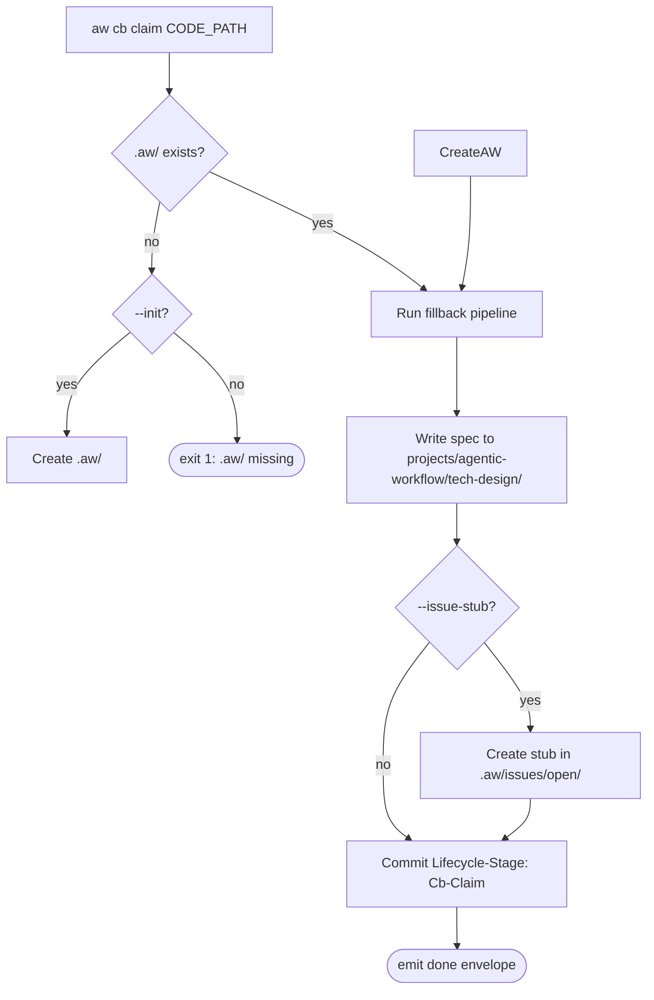

# /aw:cb-claim

Adopt existing source code into the Agentic Workflow lifecycle. `aw cb claim`
runs the fillback pipeline on the supplied path, writes the generated
TD spec to the configured `td_path` (`projects/agentic-workflow/tech-design/` for this project), and (when invoked inside an
initialized git checkout) commits a `Lifecycle-Stage: Cb-Claim` trailer.

This is the canonical Phase 2 recovery verb for adopting existing source.

## Invocation

```bash
aw cb claim <code-path> [--init] [--issue-stub] [--group <name>]
```

| Flag | Effect |
|------|--------|
| `--init` | Create `.aw/` workspace when absent (otherwise exits 1). |
| `--issue-stub` | Create a minimal issue stub at `.aw/issues/open/<derived-slug>.md`. |
| `--group <name>` | Override the tech-design group dir. Inferred from the code path otherwise. |

## Flow



## Result envelope

```json
{ "action": "done", "slug": "<derived>", "message": "..." }
```

Errors emit `{ "action": "error", "message": "..." }` with exit code 1
(missing path / fillback failure / `.aw/` missing without `--init`).

## See also

- `/aw:td:create` — start or resume a tech-design from a state:open issue.
- `/aw:td:claim` — adopt an *existing* TD spec (skip fillback).
