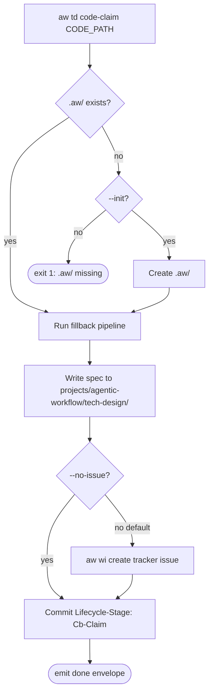

# /aw:cb-claim

Adopt existing source code into the Agentic Workflow lifecycle. `aw td code-claim`
runs the fillback pipeline on the supplied path, writes the generated
TD spec to the configured `td_path` (`projects/agentic-workflow/tech-design/` for this project), and (when invoked inside an
initialized git checkout) commits a `Lifecycle-Stage: Cb-Claim` trailer.

This is the canonical Phase 2 recovery verb for adopting existing source.

## Invocation

```bash
aw td code-claim <code-path> [--init] [--no-issue] [--group <name>] [--project <name>] [--non-interactive] [--json]
```

| Flag | Effect |
|------|--------|
| `--init` | Create `.aw/` workspace when absent (otherwise exits 1). |
| `--no-issue` | Opt out of the default-on tracker-issue creation (issue #925). By default `code-claim` files or reuses a real `aw wi create` work-item for traceability; pass this for offline/sandboxed runs with no issue backend configured. The claim itself (spec write + commit) still completes either way. |
| `--group <name>` | Override the tech-design group dir. Inferred from the code path otherwise. |
| `--project <name>` | Project name for project-scoped TD utility routing. |
| `--non-interactive` | Suppress interactive clarification prompts (auto-enabled when stdin is not a terminal). |
| `--json` | Reserved; the result envelope is already JSON by default. |

## Flow


```mermaid
flowchart TB
    Start[aw td code-claim CODE_PATH] --> AW{.aw/ exists?}
    AW -- no --> Init{--init?}
    Init -- yes --> CreateAw[Create .aw/]
    Init -- no --> Err1([exit 1: .aw/ missing])
    AW -- yes --> Fill
    CreateAw --> Fill[Run fillback pipeline]
    Fill --> Spec[Write spec to projects/agentic-workflow/tech-design/]
    Spec --> Issue{--no-issue?}
    Issue -- no default --> CreateIssue[aw wi create tracker issue]
    Issue -- yes --> Trail
    CreateIssue --> Trail[Commit Lifecycle-Stage: Cb-Claim]
    Trail --> Done([emit done envelope])
```

## Result envelope

```json
{ "action": "done", "slug": "<derived>", "claim_issue": "<tracker-ref-or-null>", "message": "..." }
```

Errors emit `{ "action": "error", "message": "..." }` with exit code 1
(missing path / fillback failure / `.aw/` missing without `--init`).

## See also

- `/aw:td:create` — start or resume a tech-design from a state:open issue.
- `/aw:td:claim` — adopt an *existing* TD spec (skip fillback).
