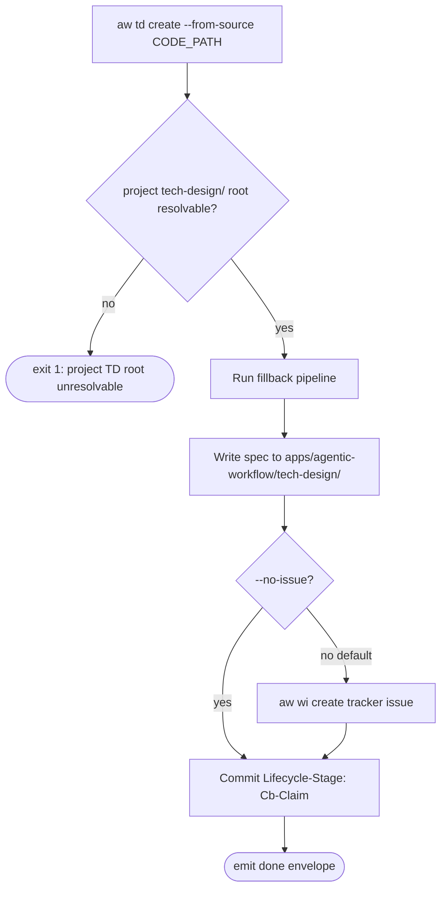

# /aw:cb-claim

Adopt existing source code into the Agentic Workflow lifecycle. `aw td
create --from-source` runs the fillback pipeline on the supplied path,
writes the generated TD spec to the resolved project-local `tech-design/`
root (`apps/agentic-workflow/tech-design/` for this project), and (when
invoked inside an initialized git checkout) commits a `Lifecycle-Stage:
Cb-Claim` trailer. The former standalone `aw td code-claim` verb was folded
into this `--from-source` mode of `aw td create` (issue #1273, epic #1270
R5); its `--init` flag (`.aw/` workspace bootstrap) has no project-local
equivalent and was retired, since a project's `tech-design/` root now
always resolves from `aw.toml`.

This is the canonical Phase 2 recovery verb for adopting existing source.

## Invocation

```bash
aw td create --from-source <code-path> [--group <name>] [--project <name>] [--no-issue] [--non-interactive]
```

| Flag | Effect |
|------|--------|
| `--group <name>` | Override the tech-design group dir. Inferred from the code path otherwise. |
| `--project <name>` | Project name for project-scoped TD utility routing. Also used to resolve the target `tech-design/` root when the source path isn't inferrable. |
| `--no-issue` | Opt out of the default-on tracker-issue creation (issue #925). By default `--from-source` files or reuses a real `aw wi create` work-item for traceability; pass this for offline/sandboxed runs with no issue backend configured. The claim itself (spec write + commit) still completes either way. |
| `--non-interactive` | Suppress interactive clarification prompts (required for non-TTY environments such as agent dispatch and CI). |

## Flow


```mermaid
flowchart TB
    Start[aw td create --from-source CODE_PATH] --> AW{project tech-design/ root resolvable?}
    AW -- no --> Err1([exit 1: project TD root unresolvable])
    AW -- yes --> Fill[Run fillback pipeline]
    Fill --> Spec[Write spec to apps/agentic-workflow/tech-design/]
    Spec --> Issue{--no-issue?}
    Issue -- no default --> CreateIssue[aw wi create tracker issue]
    Issue -- yes --> Trail
    CreateIssue --> Trail[Commit Lifecycle-Stage: Cb-Claim]
    Trail --> Done([emit done envelope])
```

## Result envelope

```json
{ "action": "done", "slug": "<derived>", "claim_issue": "<tracker-ref-or-null>", "message": "..." }
```

Errors emit `{ "action": "error", "message": "..." }` with exit code 1
(missing path / fillback failure / project TD root unresolvable).

## See also

- `/aw:td:create` — start or resume a tech-design from a state:open issue.
- `/aw:td:claim` — adopt an *existing* TD spec (skip fillback).
