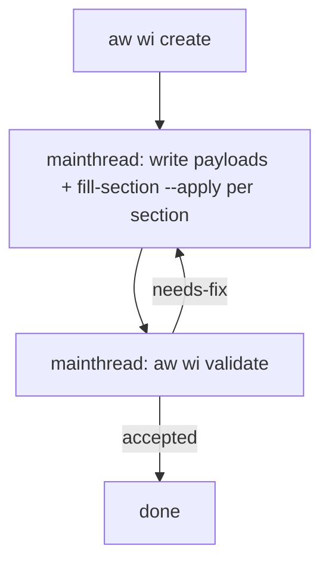

# /aw:wi

Intent router for work-item management. CLI stdout is the protocol: mutating and
workflow verbs emit structured envelopes, while list-style verbs may emit short
summaries. The **envelope protocol** in `CLAUDE.md § AW envelope (mainthread
protocol)` owns validation loops. This skill chooses the verb, relays stdout, and runs
the **mainthread-only** orchestration spelled out below.

> **Mainthread-only model (post Phase-2).** Every dispatch envelope now
> carries `agent: null`. There is no `aw-issue-author` /
> `aw-issue-reviewer` / `aw-issue-reviser` subagent to dispatch —
> those agent definitions were removed atomically with this skill
> rewrite. Mainthread takes over `--apply` directly: write the section
> payload to `.aw/payloads/<slug>/<file>.md`, run
> `aw wi fill-section --apply --section <X>`, then run
> `aw wi validate <slug>`. Loop on the emitted dispatch envelope.

## Usage

The canonical verb is `aw wi`. Legacy work-item aliases are removed; translate
old references to `aw wi`.

```
/aw:wi create "<title>" --type <type> --project <name> [--priority <pN>] [--agent <name>]
/aw:wi update <slug>
/aw:wi list [--state open|closed] [--project <name>]
/aw:wi show <slug>
/aw:wi plan --project <name> [--cap-path <path>] [--title "<plan>"]
/aw:wi epicize --project <name> [--title "<phase>"]
/aw:wi atomize --project <name> [--title "<plan>"]
/aw:wi prioritize --project <name> [--title "<plan>"]
```

`--label` is rejected on create. Labels are derived from typed flags:

* `--type` (required, closed enum): `bug | enhancement | refactor | test | epic`
* `--project <name>` (repeatable): resolved against `[[projects]]` in
  `.aw/config.toml`. `epic` accepts 0 or 1; other types require exactly 1.
* `--priority <p0|p1|p2|p3>` (optional)
* `--agent <name>` (optional): resolved against `[[agents]]` in
  `.aw/config.toml`.

Unknown `--project` / `--agent` names → error envelope on stdout, exit 2.

## create — validation loop (mainthread-only)

1. Ask the user for title + type (+ project, optional priority/agent) if not supplied.
2. Run:
   ```bash
   aw wi create --title "<t>" --type <kind> --project <name> [--priority <pN>] [--agent <name>]
   ```
3. Read the stdout envelope. The CLI returns a `dispatch`
   envelope with `agent: null` and
   `invoke.args.sections: ["all"]`. Mainthread fills the full structured
   body directly, including capability alignment, scope, acceptance criteria,
   and reference context gates.
4. **Run the mainthread loop below.** No Agent dispatch is needed; the
   per-envelope handler always writes the payload and runs `--apply`
   itself.

### Mainthread loop (per envelope)

The envelope shape and switch cases are defined in `CLAUDE.md § AW
CLI envelope (mainthread protocol)`. Mainthread-only flow:



**Mainthread runs every step.** No `Agent(subagent_type=...)` calls;
no subagent dispatch. Per-section `Fill-*` trailers still commit
individually so git history is unchanged.

### Dispatch rules

- For every `dispatch`, `agent` is `null` (or absent — the field is the
  Phase-1 deprecated shim and is omitted via `skip_serializing_if`).
  Mainthread runs `invoke.command` directly:
  - if the command is `aw wi fill-section --apply`, write the
    payload to `.aw/payloads/<slug>/body.md` first (or per-section
    payload), then run the command from mainthread.
  - if the command is `aw wi validate <slug>`, run it; parse the next envelope; loop.
- `done` → print summary; end.
- `error` → see retry-cap rules below.

### Retry cap on fill failure (2-ceiling)

When `aw wi validate` rejects mainthread's output, it emits an
`error` envelope with a qualifier tag in the message:

- `[retry=1]` → re-write the failing section's payload (with the error
  text incorporated) and re-run `aw wi fill-section --apply --section <failing>`.
- `[retry=2 takeover]` → mainthread already owns the loop — same
  recovery as `retry=1`. The phrase "takeover" is a no-op under the
  mainthread-only model and remains only as a backwards-compatible
  envelope tag.
- `[retry=N]` (N >= 3) → terminal. Surface the error to the
  user and stop. Don't auto-retry further.

## update

Currently non-envelope (legacy). Run `aw wi update <slug> --body-file -`
directly from mainthread if needed, or wait until `update` joins the
envelope protocol.

## list / show

Thin passthrough:
```bash
aw wi list [--state <state>] [--project <name>]
aw wi show <slug>
```

Prefer `--project <name>` for project-scoped lists; it resolves the
configured project label from `.aw/config.toml`. Use `--label` only as a
raw low-level label filter.

## Planning operators

Planning commands read the configured issue backend and write local artifacts
under `/tmp/aw/<project>/`. They do not publish or mutate tracker issues.

Use this lane after `/aw:capability` confirms a capability or when the user gives a
roadmap-sized request. Large work must stay as `type=epic` or a local planning
artifact until atomized into bounded WI candidates.

```bash
aw wi plan --project <name> [--cap-path <path>] [--title "<plan>"]
aw wi epicize --project <name> [--title "<phase>"]
aw wi atomize --project <name> [--title "<plan>"]
aw wi prioritize --project <name> [--title "<plan>"]
aw run --project <name> --max-ticks 1
```

- `plan` reads the confirmed capability table from `--cap-path`, `[[projects]].cap_path`,
  or `[[projects]].path/README.md`, cross-checks it against open work-items,
  and writes a local capability-to-WI planning draft under
  `/tmp/aw/<project>/capability-plan/`.
- `epicize` inventories every open issue for the project, groups
  requirements into epic candidates, and writes the local classification
  draft under `/tmp/aw/<project>/epics/`. The artifact explicitly requires
  agent review before publishing tracker changes.
- `atomize` inventories epic/roadmap-sized issues and writes atomic WI
  candidates under `/tmp/aw/<project>/atomize/`. The artifact requires human
  review before any candidate is published.
- `prioritize` inventories every open issue for the project and writes a
  local priority review draft under `/tmp/aw/<project>/priorities/`,
  covering ready work, dependency blockers, atomization needs, triage blockers,
  and deferred work.
  The artifact explicitly requires agent review before publishing priority
  label or ordering changes.
- `aw run --project` is the run-to-end project root. It consumes capability
  and prioritized WI readiness instead of relying on cron-style sprint batches.

### Bounded WI gate

Non-epic work-items must be atomic before they enter `/aw:td`:

- `## Capability Alignment` with `Capability`, `Capability Gap`, and
  `Progress Evidence`.
- `## Scope` with concrete in-scope and out-of-scope bullets.
- `## Acceptance Criteria` with at least one real list item.
- `## Reference Context` with related specs and a concrete spec plan.
- Roadmap-sized or decision-blocked work goes back to `atomize` or HITL review.

## Recovery

If a session ends mid-validation, inspect the work-item with `aw wi show <slug>`
and continue from the phase recorded in frontmatter. There is no idle scanner
or per-slug AW workspace recovery path.
