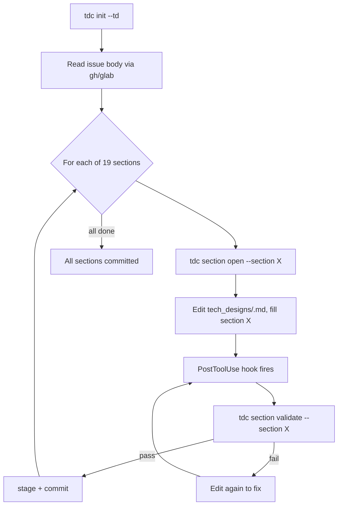

# /tdc:create

Lite tech-design entry point. No CRRR loop, no reviewer, no reviser — mainthread (you) writes each section, the `tdc section validate` hook gates each commit.

## Usage

```
/tdc:create <issue-url> --td <td-name>
```

- `<issue-url>` — `https://github.com/<owner>/<repo>/issues/<n>` or `https://gitlab.com/<owner>/<repo>/-/issues/<n>`
- `--td <td-name>` — topic name; becomes `tech_designs/<td-name>.md`

## Flow



## Step-by-step

1. **Bootstrap.** Run `tdc init <issue-url> --td <td-name>`.
   - Parses URL, derives slug (`gh-iss-042` / `glab-iss-012`).
   - Writes `.tdc/state.toml` with `{slug, td, issue_url, sections_done: []}`.
   - Scaffolds `tech_designs/<td>.md` with 19 empty section headers (if file does not exist).
   - Reads issue title/body via `gh api` or `glab api` and stores summary in state.

2. **Loop sections.** For each section in `tdc section list --json` where `status: pending`:
   - Run `tdc section open --section <id>` — CLI marks the section as active in state.toml. Stdout prints authoring guidance for that section type (schema for that section, expected format).
   - Read `tech_designs/<td>.md`, find the `## <id>` header.
   - Use `Edit` to fill the section body. Match the format the guidance specifies (OpenRPC, JSON Schema, Mermaid, etc).
   - The PostToolUse hook fires `tdc section validate --section <id>` automatically:
     - On pass: it stages `tech_designs/<td>.md` and commits with message `tdc(<slug>): fill <td>/<section>`.
     - On fail: it prints rule violations. Re-edit and the hook re-runs.

3. **Done.** All 19 sections committed; `tdc state` shows `sections_done` is full. Stop. Do not run `/tdc:gen-codebase` automatically — that is a separate explicit skill.

## What you (mainthread) actually do

- Run `tdc init` ONCE.
- Loop: run `tdc section open --section X`, read its stdout, then `Edit` the spec file.
- The hook handles validate + commit. Do **not** call `tdc section validate` yourself; it will run on every Edit to the spec.
- Do **not** dispatch any subagent. Section authoring is mainthread-only.

## Stopping conditions

- All 19 sections committed → success.
- `tdc section open` returns non-zero with `error: <reason>` → surface to user, stop.
- User interrupts → stop. The state in `.tdc/state.toml` is durable; re-running `/tdc:create` resumes from `sections_done`.

## Section list (sealed, from SDD AUTHORING.md)

API: `rest-api`, `rpc-api`, `async-api`, `schema`, `cli`, `config`
Flow/state: `state-machine`, `logic`, `db-model`, `dependency`, `interaction`, `scenarios`
UI: `wireframe`, `component`, `design-token`
Test/deploy: `unit-test`, `e2e-test`, `manifest`
Meta (always last): `changes`
