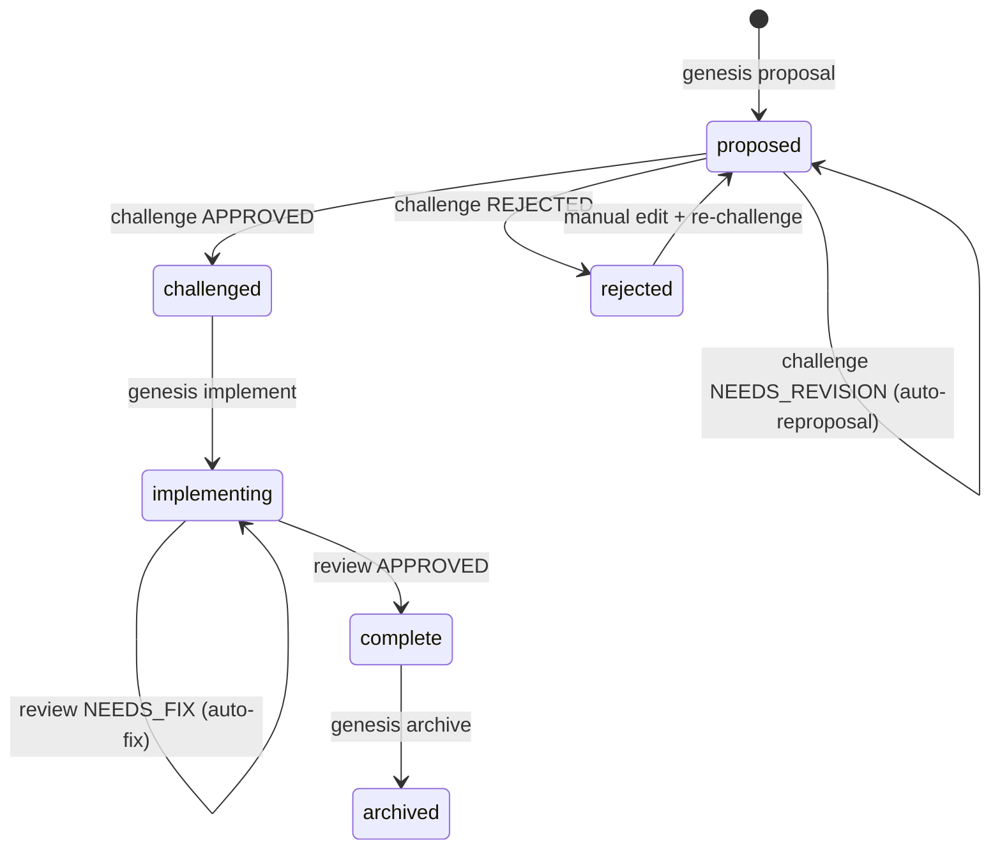
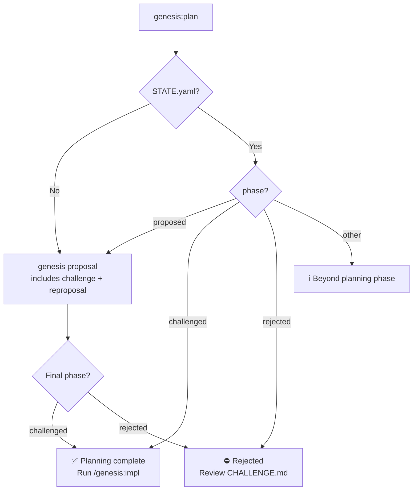
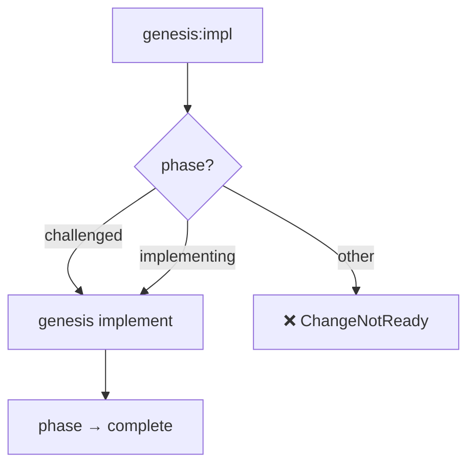
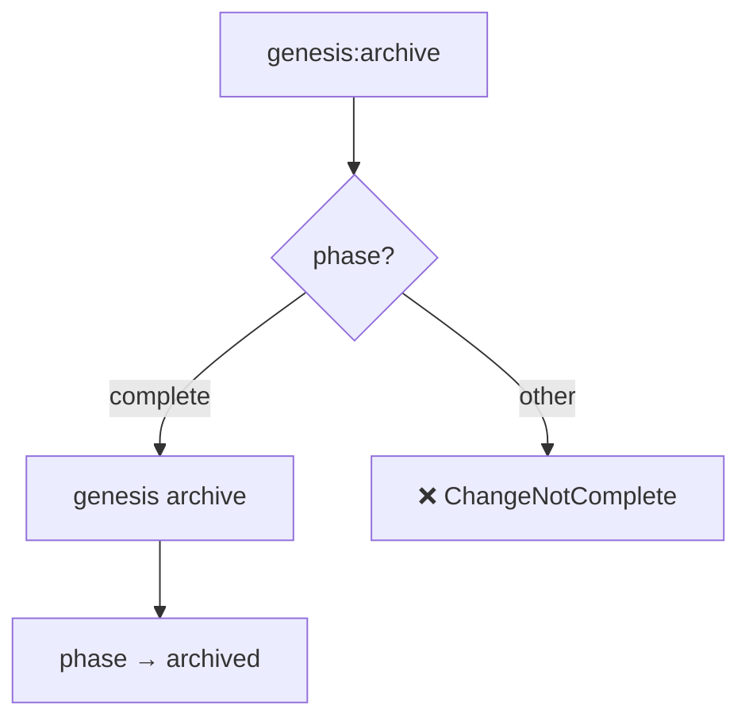

# Specification: High-Level Workflows

## Overview

This specification defines the behavior of the consolidated high-level Genesis workflows: `plan`, `impl`, and `archive`. These workflows automate transitions by inspecting only the `phase` field in `STATE.yaml`.

**Key Design Principle**: Workflow commands only check `phase`. The `challenge` command is responsible for updating `phase` based on verdict.

## Requirements

### R1: Phase-Only State Machine

All workflow commands MUST determine their action solely based on the `phase` field in `STATE.yaml`. Valid phases are:

| Phase | Description |
|-------|-------------|
| `proposed` | Proposal exists, not yet challenged or needs revision |
| `challenged` | Challenge passed (APPROVED), ready for implementation |
| `rejected` | Challenge rejected, requires manual intervention |
| `implementing` | Implementation in progress |
| `complete` | Implementation finished, ready for archive |
| `archived` | Change archived |

### R2: Challenge Updates Phase

The `genesis challenge` command MUST update `STATE.yaml` phase based on verdict:

| Verdict | New Phase | Rationale |
|---------|-----------|-----------|
| `APPROVED` | `challenged` | Ready for implementation |
| `NEEDS_REVISION` | `proposed` | Stays in proposed, triggers reproposal |
| `REJECTED` | `rejected` | Fundamental issues, manual intervention needed |

### R3: Plan Workflow Orchestration

The `plan` workflow MUST:
- If no STATE.yaml exists → run `genesis proposal` (requires description)
  - Note: `genesis proposal` internally handles challenge + auto-reproposal loop
  - Final phase is set by the challenge verdict (challenged/rejected)
- If `phase: proposed` → run `genesis proposal` to continue the planning cycle
- If `phase: challenged` → inform user planning is complete, suggest `/genesis:impl`
- If `phase: rejected` → inform user of rejection, suggest manual review
- If `phase: implementing/complete/archived` → inform user change is beyond planning

### R4: Implementation Workflow Orchestration

The `impl` workflow MUST:
- If `phase: challenged` → run `genesis implement`
- If `phase: implementing` → continue with `genesis implement`
- Otherwise → return `ChangeNotReady` error with guidance

### R5: Archive Workflow Orchestration

The `archive` workflow MUST:
- If `phase: complete` → run `genesis archive`
- Otherwise → return `ChangeNotComplete` error

## Flow

### Phase State Machine



### Plan Workflow Logic



### Implementation Workflow Logic



### Archive Workflow Logic



## Interfaces

```
FUNCTION plan_workflow(change_id: String, description: Option<String>) -> Result<WorkflowAction, Error>
  INPUT: Change ID and optional description for initial proposal
  OUTPUT: Action taken (Proposed, Challenged, AlreadyComplete, etc.)
  ERRORS: ChangeNotFound, Rejected, MissingDescription (if no STATE.yaml and no description provided)

  Usage: /genesis:plan <change-id> ["<description>"]
  - Description is required for new changes (no STATE.yaml)
  - Description is ignored for existing changes

FUNCTION impl_workflow(change_id: String) -> Result<WorkflowAction, Error>
  INPUT: Change ID
  OUTPUT: Implementation status
  ERRORS: ChangeNotReady (if phase not in [challenged, implementing])

FUNCTION archive_workflow(change_id: String) -> Result<WorkflowAction, Error>
  INPUT: Change ID
  OUTPUT: Archival confirmation
  ERRORS: ChangeNotComplete (if phase != complete)
```

## Acceptance Criteria

### Scenario: Initial Planning
- **WHEN** `genesis:plan` is called for a new change-id with description
- **THEN** runs `genesis proposal` (which includes challenge + auto-reproposal)
- **THEN** final phase reflects challenge verdict: `challenged` (APPROVED) or `rejected` (REJECTED)

### Scenario: Continue Planning
- **WHEN** `genesis:plan` is called with `phase: proposed`
- **THEN** runs `genesis proposal` to continue the planning cycle
- **THEN** final phase reflects challenge verdict

### Scenario: Planning Complete
- **WHEN** `genesis:plan` is called with `phase: challenged`
- **THEN** informs user planning is complete and suggests `/genesis:impl`

### Scenario: Rejected Proposal
- **WHEN** `genesis:plan` is called with `phase: rejected`
- **THEN** informs user of rejection and suggests reviewing CHALLENGE.md

### Scenario: Start Implementation
- **WHEN** `genesis:impl` is called with `phase: challenged`
- **THEN** runs `genesis implement` and sets `phase: implementing`

### Scenario: Continue Implementation
- **WHEN** `genesis:impl` is called with `phase: implementing`
- **THEN** continues `genesis implement`

### Scenario: Implementation Not Ready
- **WHEN** `genesis:impl` is called with `phase: proposed`
- **THEN** returns ChangeNotReady error

### Scenario: Archive Complete Change
- **WHEN** `genesis:archive` is called with `phase: complete`
- **THEN** runs `genesis archive` and sets `phase: archived`

### Scenario: Archive Not Ready
- **WHEN** `genesis:archive` is called with `phase: implementing`
- **THEN** returns ChangeNotComplete error
