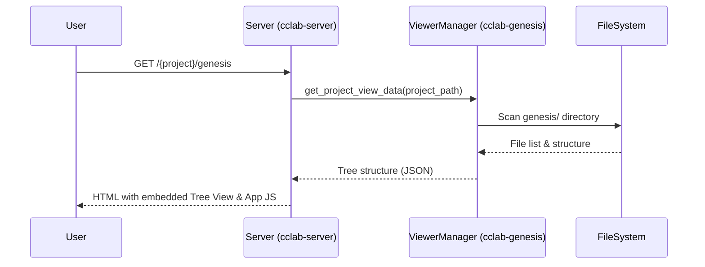

---
id: plan-viewer
type: spec
title: "Plan Viewer Expansion"
version: 1
created_at: 2026-01-24T14:57:43.473207+00:00
updated_at: 2026-01-24T14:57:43.473207+00:00
requirements:
  total: 6
  ids:
    - R1
    - R2
    - R3
    - R4
    - R5
    - R6
design_elements:
  has_mermaid: true
  has_json_schema: true
  has_pseudo_code: false
  has_api_spec: false
history:
  - timestamp: 2026-01-24T14:57:43.473207+00:00
    agent: "mcp"
    tool: "create_spec"
    action: "created"
  - timestamp: 2026-01-24T14:59:18.818744+00:00
    agent: "gemini-3-flash-preview"
    tool: "revise_spec"
    action: "revised"
    duration_secs: 206.27
  - timestamp: 2026-01-24T14:59:35.685952+00:00
    agent: "gpt-5.2-codex"
    tool: "review_spec"
    action: "reviewed"
    duration_secs: 16.87---

<spec>

# Plan Viewer Expansion

## Overview

<meta>
  <constraint>NO actual implementation code - use abstractions only</constraint>
  <abstractions>Mermaid, JSON Schema, Pseudo code, WHEN/THEN</abstractions>
</meta>

This specification defines the expansion of Genesis Viewer from a single-change viewer into a comprehensive project-level Genesis browser. It introduces project-level routing, tree-based navigation, and enhanced Markdown rendering capabilities including LaTeX, Mermaid, and interactive table sorting. This allows developers to browse all specifications, knowledge documents, and archives within a project in a unified, rich interface.

## Requirements

### R1 - Project-Level Routing Support

```yaml
id: R1
priority: high
status: draft
```

Implement `/{project}/genesis` route in `cclab-server` to serve the project-level view, displaying contents of the `genesis/` directory including `specs/`, `knowledge/`, and `archive/`.

### R2 - Tree Navigation Interface

```yaml
id: R2
priority: high
status: draft
```

Implement a tree view navigation interface in the frontend to support browsing hierarchical directory structures with expand/collapse functionality.

### R3 - Content Preview Functionality

```yaml
id: R3
priority: medium
status: draft
```

Support instant content preview when a file is selected in the navigation tree.

### R4 - LaTeX Rendering Support

```yaml
id: R4
priority: medium
status: draft
```

Integrate KaTeX to support rendering of LaTeX mathematical formulas within Markdown documents.

### R5 - Interactive Table Sorting

```yaml
id: R5
priority: low
status: draft
```

Implement client-side table sorting for Markdown tables, allowing users to sort data by clicking on column headers.

### R6 - Auto-Open Skill (genesis-view-project)

```yaml
id: R6
priority: medium
status: draft
```

Register a new skill `genesis-view-project` that automatically opens the project browser URL in the default browser.

## Acceptance Criteria

### Scenario: Browsing Project Genesis Directory

- **GIVEN** The cclab server is running and has registered project 'my-app'.
- **WHEN** User visits http://localhost:3456/my-app/genesis.
- **THEN** The browser opens the project overview page showing the 'specs/' and 'knowledge/' directories in a tree structure.

### Scenario: Tree Navigation Interaction

- **GIVEN** The navigation interface has loaded the file list.
- **WHEN** User clicks on the 'knowledge' directory icon.
- **THEN** The sub-directory expands and displays the .md files within it.

### Scenario: LaTeX Formula Rendering

- **GIVEN** A Markdown file contains LaTeX formulas like $E=mc^2$ or $$ ... $$ blocks.
- **WHEN** User opens the file for preview.
- **THEN** The mathematical formulas are correctly rendered by KaTeX with high-quality typesetting.

### Scenario: Interactive Table Sorting

- **GIVEN** A Markdown file containing a table is being viewed.
- **WHEN** User clicks on a table column header.
- **THEN** The table rows are re-ordered based on the values in that column.

## Flow Diagram



## Data Model

```json
{
  "properties": {
    "children": {
      "items": {
        "\"$ref\"": "#/properties/nodes/items"
      },
      "type": "array"
    },
    "id": {
      "description": "Unique identifier for the node",
      "type": "string"
    },
    "is_directory": {
      "type": "boolean"
    },
    "name": {
      "description": "Display name of the file or directory",
      "type": "string"
    },
    "path": {
      "description": "Relative path from the genesis root",
      "type": "string"
    }
  },
  "required": [
    "id",
    "name",
    "path",
    "is_directory"
  ],
  "type": "object"
}
```

</spec>
