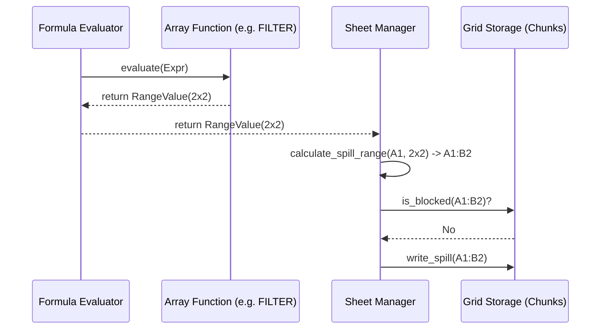

<spec>

# Grid Array Formula Specification

## Overview

This specification defines the support for array formulas and dynamic arrays in cclab-grid. It covers the evaluation process where a single formula can return multiple values that 'spill' into adjacent cells.

## Requirements

### R1 - Range Value Support

```yaml
id: R1
priority: medium
status: draft
```

Allow the formula evaluator to return a 2D array of CellValue (RangeValue).

### R2 - Dynamic Spilling

```yaml
id: R2
priority: medium
status: draft
```

Automatically populate adjacent cells with the results of an array-returning formula.

### R3 - Spill Collision Detection

```yaml
id: R3
priority: medium
status: draft
```

Detect and handle cases where the spill range is blocked by existing data (#SPILL! error).

### R4 - Spill Range Integrity

```yaml
id: R4
priority: medium
status: draft
```

Ensure that editing a cell in a spill range (other than the origin) is prevented or handled correctly.

## Acceptance Criteria

### Scenario: Successful Spill

- **GIVEN** A formula that returns a 3x1 array in A1
- **WHEN** Evaluating the formula.
- **THEN** A1, A2, and A3 should show the results, and the selection of A1 should show the spill border.

### Scenario: Spill Blocked

- **GIVEN** A formula in A1 that needs to spill to A2, but A2 has data
- **WHEN** Evaluating the formula.
- **THEN** A1 should display a #SPILL! error.

### Scenario: Clear Spill Source

- **GIVEN** An active spill range A1:A3
- **WHEN** Deleting the formula in A1.
- **THEN** A1, A2, and A3 should all become empty.

## Flow Diagram



</spec>
