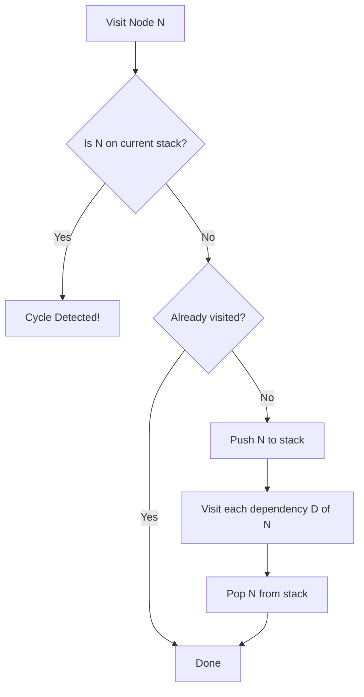

<spec>

# Grid Performance Specification

## Overview

This specification defines the performance and reliability requirements for cclab-grid, focusing on circular dependency detection in the formula engine and scalability benchmarks for large datasets.

## Requirements

### R1 - Circular Dependency Detection

```yaml
id: R1
priority: medium
status: draft
```

Detect circular references in formulas and return #REF! error. Use Tarjan's or simple DFS with stack.

### R2 - 100k+ Row Support

```yaml
id: R2
priority: medium
status: draft
```

Ensure the grid can handle 100,000+ rows with responsive editing and recalculation.

### R3 - Performance Benchmarks

```yaml
id: R3
priority: medium
status: draft
```

Establish a benchmarking suite for common operations (read, write, evaluate, render).

## Acceptance Criteria

### Scenario: Detect Direct Cycle

- **GIVEN** A1 = B1 + 1, B1 = A1 + 1
- **WHEN** Setting the formulas.
- **THEN** Both cells should show #REF! and indicate circularity.

### Scenario: Detect Indirect Cycle

- **GIVEN** A1 = B1, B1 = C1, C1 = A1
- **WHEN** Completing the chain.
- **THEN** All involved cells should detect the cycle.

### Scenario: Large Scale Recalculation

- **GIVEN** A sheet with 100,000 rows and random formulas
- **WHEN** Changing a leaf value that affects 1000 cells.
- **THEN** Recalculation should complete within 500ms on standard hardware.

## Diagrams

### Circular Dependency Detection (DFS)



<semantic-data>

```json
{
  "edges": [],
  "metadata": null,
  "nodes": [
    {
      "id": "visit_node",
      "semantic": {
        "type": "start"
      }
    },
    {
      "id": "is_on_stack",
      "semantic": {
        "type": "condition"
      }
    },
    {
      "id": "cycle_found",
      "semantic": {
        "error": {
          "code": 651,
          "message": "Circular dependency detected"
        },
        "type": "raise_error"
      }
    },
    {
      "id": "is_visited",
      "semantic": {
        "type": "condition"
      }
    },
    {
      "id": "push_stack",
      "semantic": {
        "type": "assign"
      }
    },
    {
      "id": "visit_deps",
      "semantic": {
        "type": "transform"
      }
    },
    {
      "id": "pop_stack",
      "semantic": {
        "type": "assign"
      }
    },
    {
      "id": "done",
      "semantic": {
        "type": "end"
      }
    }
  ]
}
```

</semantic-data>

</spec>
