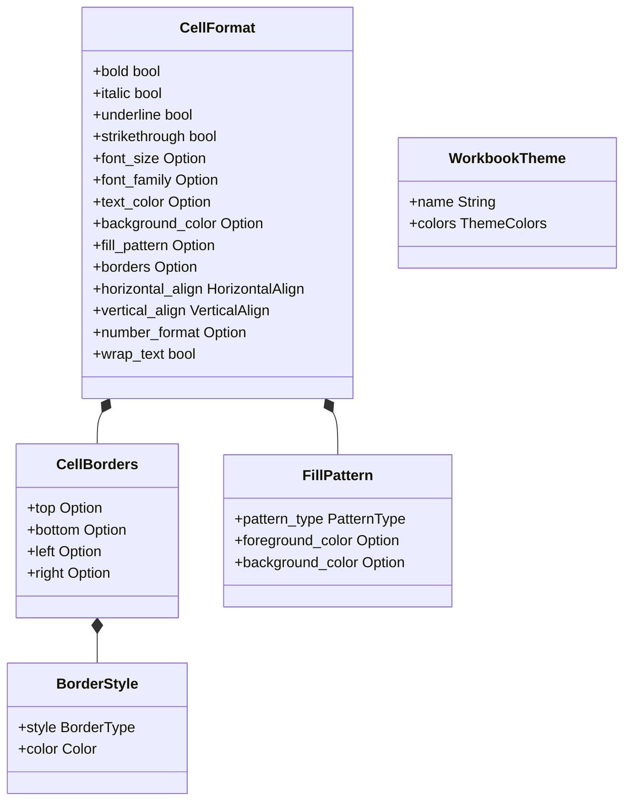

<spec>

# Grid Styling Specification

## Overview

This specification defines the rich styling capabilities for cclab-grid, including borders, pattern fills, and workbook themes. These enhancements aim to provide a styling engine comparable to SheetJS and Google Sheets.

## Requirements

### R1 - Cell Borders

```yaml
id: R1
priority: medium
status: draft
```

Support for cell borders on all four sides with custom styles (solid, dashed, dotted, thick) and colors.

### R2 - Pattern Fills

```yaml
id: R2
priority: medium
status: draft
```

Support for pattern fills (solid, diagonal, gray shades) with foreground and background colors.

### R3 - Workbook Themes

```yaml
id: R3
priority: medium
status: draft
```

Support for workbook-level themes that define color palettes and default styles.

### R4 - Styling Serialization

```yaml
id: R4
priority: medium
status: draft
```

Ensure all styling properties are serializable to JSON for persistence and collaboration.

## Acceptance Criteria

### Scenario: Apply Borders

- **GIVEN** A default cell format
- **WHEN** Applying a thick red top border and a solid blue bottom border.
- **THEN** The cell format should contain the specified border properties.

### Scenario: Apply Pattern Fill

- **GIVEN** A cell with background color
- **WHEN** Applying a diagonal stripe pattern with green foreground and white background.
- **THEN** The cell format should reflect the pattern type and foreground/background colors.

### Scenario: Apply Theme Palette

- **GIVEN** A workbook with default theme
- **WHEN** Switching to a 'Dark Mode' theme.
- **THEN** Styles referencing theme colors should resolve correctly to the new palette.

## Flow Diagram



## API Specification (JSON Schema)

```yaml
$schema: http://json-schema.org/draft-07/schema#
definitions:
  BorderStyle:
    properties:
      color:
        type: string
      style:
        enum:
        - solid
        - dashed
        - dotted
        - thick
        - double
        - hair
        type: string
    required:
    - style
    - color
    type: object
  CellBorders:
    properties:
      bottom:
        $ref: '#/definitions/BorderStyle'
      left:
        $ref: '#/definitions/BorderStyle'
      right:
        $ref: '#/definitions/BorderStyle'
      top:
        $ref: '#/definitions/BorderStyle'
    type: object
  FillPattern:
    properties:
      background_color:
        type: string
      foreground_color:
        type: string
      pattern_type:
        enum:
        - solid
        - gray125
        - lightGray
        - mediumGray
        - darkGray
        - darkVertical
        - darkHorizontal
        - darkDown
        - darkUp
        - darkGrid
        - darkTrellis
        - lightVertical
        - lightHorizontal
        - lightDown
        - lightUp
        - lightGrid
        - lightTrellis
        type: string
    required:
    - pattern_type
    type: object
properties:
  background_color:
    type: string
  bold:
    type: boolean
  borders:
    $ref: '#/definitions/CellBorders'
  fill_pattern:
    $ref: '#/definitions/FillPattern'
  font_family:
    type: string
  font_size:
    type: integer
  horizontal_align:
    enum:
    - left
    - center
    - right
    type: string
  italic:
    type: boolean
  number_format:
    type: string
  strikethrough:
    type: boolean
  text_color:
    type: string
  underline:
    type: boolean
  vertical_align:
    enum:
    - top
    - middle
    - bottom
    type: string
  wrap_text:
    type: boolean
title: CellFormat
type: object
```

</spec>
