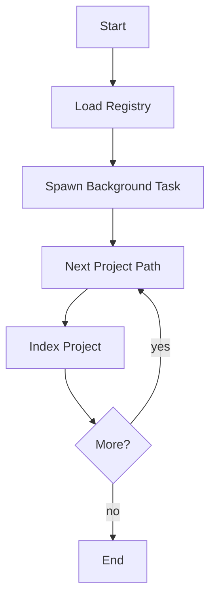

<spec>

# Prism Automatic Initialization

## Overview

This specification defines the automatic initialization of Prism handlers for registered projects at server startup. The goal is to improve responsiveness by pre-indexing registered projects, avoiding the initial delay caused by lazy initialization on the first request. It also ensures that registered projects are persisted across server restarts.

## Requirements

### R1 - Registry Persistence

```yaml
id: R1
priority: medium
status: draft
```

Registered projects must be preserved in ~/.cclab/registry.json even when the server process is stopped.

### R2 - Background Initialization

```yaml
id: R2
priority: medium
status: draft
```

The server must automatically trigger indexing for all registered projects upon startup.

### R3 - Non-blocking Startup

```yaml
id: R3
priority: medium
status: draft
```

Project indexing must run in a background task to avoid delaying server availability.

### R4 - CLI Integration

```yaml
id: R4
priority: medium
status: draft
```

The CLI must be updated to correctly handle existing projects when starting a new server instance.

## Acceptance Criteria

### Scenario: Persistent Projects Load

- **GIVEN** A server with 3 registered projects is shut down and restarted.
- **WHEN** The server is started.
- **THEN** The server starts, and the 3 projects are still listed in the registry and background indexing begins for them.

### Scenario: Background Indexing Starts

- **GIVEN** A large project is registered in the server.
- **WHEN** The server starts.
- **THEN** The server becomes available immediately on port 3456, while indexing proceeds in the background.

### Scenario: Automatic Indexing Completion

- **GIVEN** A server starts with existing projects in the registry.
- **WHEN** Wait for background tasks to complete.
- **THEN** The PrismHandlerPool eventually contains initialized handlers for all registered projects without any user interaction.

### Scenario: CLI Merge Existing Projects

- **GIVEN** A server is started after a system crash.
- **WHEN** cc server start --port 3456
- **THEN** The new server instance detects the existing registry and merges the registered projects instead of overwriting them.

## Diagrams

### Initialization Algorithm



<semantic-data>

```json
{
  "edges": [],
  "metadata": null,
  "nodes": [
    {
      "id": "start_node",
      "semantic": {
        "type": "start"
      }
    },
    {
      "id": "load_node",
      "semantic": {
        "table": "registry.json",
        "type": "db_query"
      }
    },
    {
      "id": "spawn_node",
      "semantic": {
        "type": "assign"
      }
    },
    {
      "id": "iter_node",
      "semantic": {
        "type": "assign"
      }
    },
    {
      "id": "index_node",
      "semantic": {
        "method": "POST",
        "type": "api_call",
        "url": "/mcp/index"
      }
    },
    {
      "id": "check_node",
      "semantic": {
        "condition": "has_more_projects",
        "type": "condition"
      }
    },
    {
      "id": "end_node",
      "semantic": {
        "type": "end"
      }
    }
  ]
}
```

</semantic-data>

</spec>
