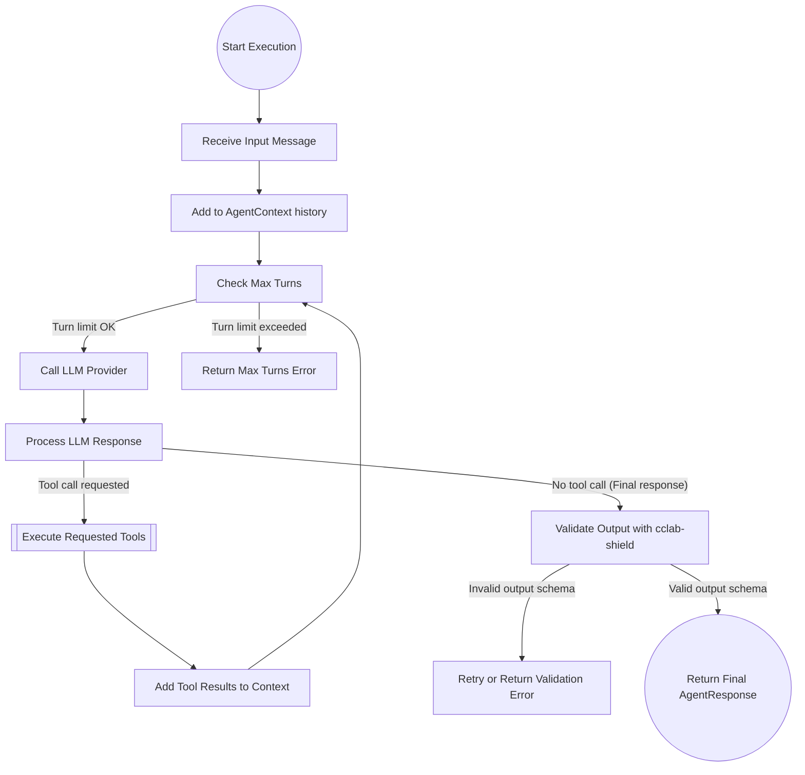

<spec>

# cclab-nova-core Specification

## Overview

Core agent abstractions, context management, and execution engine. This spec defines the fundamental building blocks for agents, including state management, conversation history, and the execution loop with tool support and structured output validation.

## Requirements

### R1 - Structured Output Validation

```yaml
id: R1
priority: high
status: draft
```

Integrate cclab-shield for schema-validated LLM responses. Support defining expected output models.

### R2 - RunContext Dependency Injection

```yaml
id: R2
priority: high
status: draft
```

Enhance AgentContext to support a generic RunContext for dependency injection. Allow passing resources to tools and agents.

### R3 - Copy-on-Write State Management

```yaml
id: R3
priority: medium
status: draft
```

Ensure SharedState uses Arc correctly for GIL-free state management, optimized for Python integration.

### R4 - Agent Execution Loop

```yaml
id: R4
priority: high
status: draft
```

Implement a robust execution loop with configurable retries, timeouts, and error handling.

## Acceptance Criteria

### Scenario: Successful execution with structured output

- **GIVEN** An agent with a defined output schema (cclab-shield model).
- **WHEN** The agent finishes its task and returns a JSON response.
- **THEN** The final response is validated against the schema and returned as a structured object.

### Scenario: Max turns reached error

- **GIVEN** An agent with a system prompt and a max_turns limit.
- **WHEN** The agent conversation exceeds the max_turns limit.
- **THEN** An AgentError::MaxTurnsReached is returned, and execution stops.

### Scenario: Dependency injection in tool execution

- **GIVEN** A RunContext containing a database connection.
- **WHEN** A tool is executed that requires access to a database.
- **THEN** The tool successfully accesses the database connection from the context.

## Flow Diagram



</spec>
