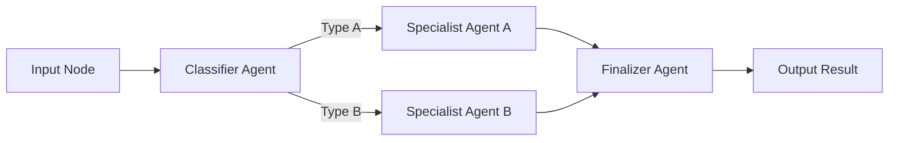

<spec>

# cclab-nova-graph Specification

## Overview

Graph-based workflow engine for multi-agent orchestration. Allows defining complex agent interactions as a Directed Acyclic Graph (DAG) with state propagation and conditional branching. Inspired by LangGraph but optimized for Rust performance.

## Requirements

### R1 - DAG Executor

```yaml
id: R1
priority: high
status: draft
```

Implement a high-performance DAG executor that can run nodes asynchronously and manage data dependencies.

### R2 - State Propagation

```yaml
id: R2
priority: high
status: draft
```

Support state persistence and propagation between graph nodes using Copy-on-Write (Arc) patterns.

### R3 - Conditional Branching

```yaml
id: R3
priority: medium
status: draft
```

Allow defining conditional edges based on node outputs (branching logic).

## Acceptance Criteria

### Scenario: Conditional routing in graph

- **GIVEN** A graph with a classifier node and two worker nodes.
- **WHEN** The classifier node identifies the input type.
- **THEN** The graph correctly routes the execution to the appropriate worker node based on classifier output.

### Scenario: State persistence across nodes

- **GIVEN** A multi-step graph where nodes update a shared state object.
- **WHEN** The graph completes execution.
- **THEN** The final node receives the cumulative state updates from all previous nodes.

### Scenario: Parallel execution of independent nodes

- **GIVEN** A graph with multiple independent branches.
- **WHEN** The graph is executed.
- **THEN** The independent nodes are executed concurrently to minimize total execution time.

## Flow Diagram



</spec>
