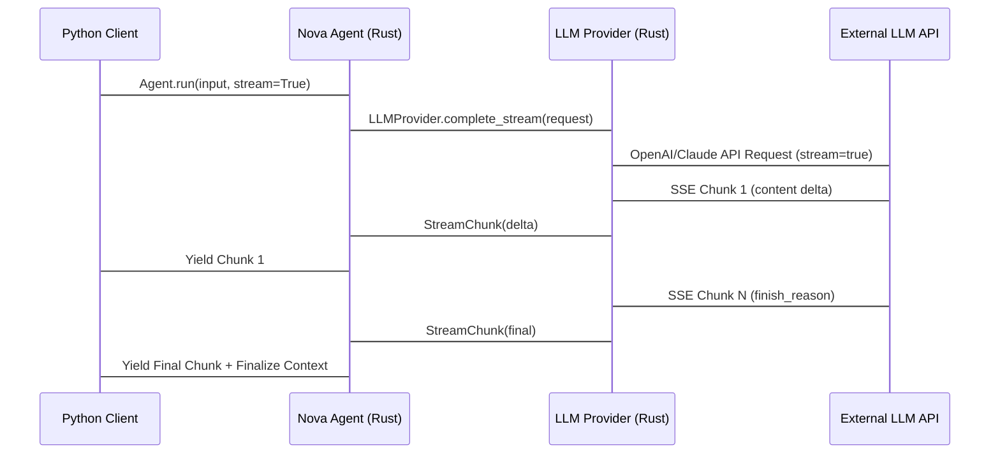

<spec>

# cclab-nova-llm Specification

## Overview

Unified LLM provider interface and implementation for multiple providers (OpenAI, Anthropic Claude) and gateways (LiteLLM, OpenRouter). Supports streaming, tool calling, and structured output integration.

## Requirements

### R1 - Claude Provider Enhancements

```yaml
id: R1
priority: high
status: draft
```

Fix ClaudeProvider compilation errors (chained calls on HttpClient) and implement streaming support using Server-Sent Events (SSE).

### R2 - Gateway Support

```yaml
id: R2
priority: medium
status: draft
```

Add support for LiteLLM and OpenRouter as providers/gateways. Implement dynamic routing logic.

### R3 - Full Streaming Support

```yaml
id: R3
priority: high
status: draft
```

Ensure all providers correctly propagate streaming chunks to the Agent layer.

## Acceptance Criteria

### Scenario: Claude streaming response

- **GIVEN** A ClaudeProvider with a valid API key.
- **WHEN** A streaming completion request is sent to Claude.
- **THEN** A stream of StreamChunk objects is returned, containing content deltas.

### Scenario: Gateway routing to specific model

- **GIVEN** An OpenRouter provider configuration.
- **WHEN** A request is made to a model available via OpenRouter.
- **THEN** The request is correctly routed to the chosen model through the gateway.

## Flow Diagram



</spec>
