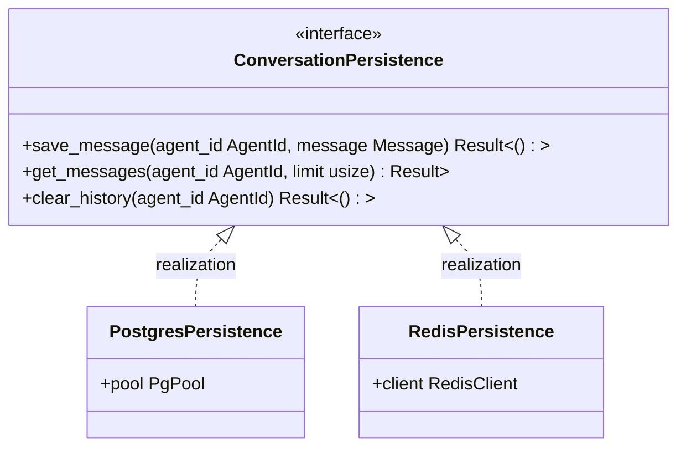

<spec>

# cclab-nova-persistence Specification

## Overview

Persistence layer for agent conversations. Provides adapters for storing and retrieving conversation history in different backends like PostgreSQL and Redis. Ensures agents can maintain context across different sessions.

## Requirements

### R1 - PostgreSQL Persistence Adapter

```yaml
id: R1
priority: high
status: draft
```

Implement a PostgreSQL adapter for robust, permanent storage of conversation history.

### R2 - Redis Persistence Adapter

```yaml
id: R2
priority: medium
status: draft
```

Implement a Redis adapter for high-performance, temporary/cached storage of conversation history.

### R3 - Thread-Safe Persistence

```yaml
id: R3
priority: high
status: draft
```

Ensure thread-safe access to persistence backends from multiple agent instances.

## Acceptance Criteria

### Scenario: Save and retrieve message from Postgres

- **GIVEN** An agent configured with PostgresPersistence.
- **WHEN** The agent sends a message.
- **THEN** The message is saved to the database and correctly retrieved later.

### Scenario: Fast retrieval from Redis

- **GIVEN** An agent configured with RedisPersistence.
- **WHEN** The agent starts a new session for a known user.
- **THEN** The conversation history is retrieved with low latency.

## Flow Diagram



</spec>
