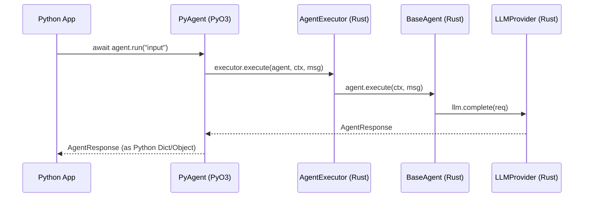

<spec>

# cclab-nova-python Specification

## Overview

Python bindings for cclab-nova using PyO3. Provides a high-level, idiomatic Python API for creating agents, defining workflows, and using standard tools, while delegating heavy execution to the Rust core. Supports async/await and streaming.

## Requirements

### R1 - PyO3 Bindings for Core Components

```yaml
id: R1
priority: high
status: draft
```

Expose core Nova components (Agent, Tools, State, Graph) to Python via PyO3. Ensure efficient data conversion between Rust and Python.

### R2 - Async Python API Support

```yaml
id: R2
priority: high
status: draft
```

Provide a seamless async Python API for agent execution. Support Python's async/await and async generators for streaming.

### R3 - Structured Output Integration

```yaml
id: R3
priority: high
status: draft
```

Support Pydantic-style structured output validation in Python using cclab-shield. Allow users to define response models as Python classes.

## Acceptance Criteria

### Scenario: Creating and running an agent in Python

- **GIVEN** A Python environment with cclab-nucleus installed.
- **WHEN** A user defines an Agent and calls await agent.run("Hello").
- **THEN** The agent executes in Rust and returns the result to Python asynchronously.

### Scenario: Streaming agent response to Python

- **GIVEN** An agent configured with stream=True in Python.
- **WHEN** A user calls async for chunk in agent.run("Hello", stream=True).
- **THEN** The user can iterate over the response chunks using 'async for'.

### Scenario: Validated output in Python

- **GIVEN** A Python class defined as a response model.
- **WHEN** A user passes the class as response_model to agent.run().
- **THEN** The agent response is automatically validated and returned as an instance of the class.

## Flow Diagram



</spec>
