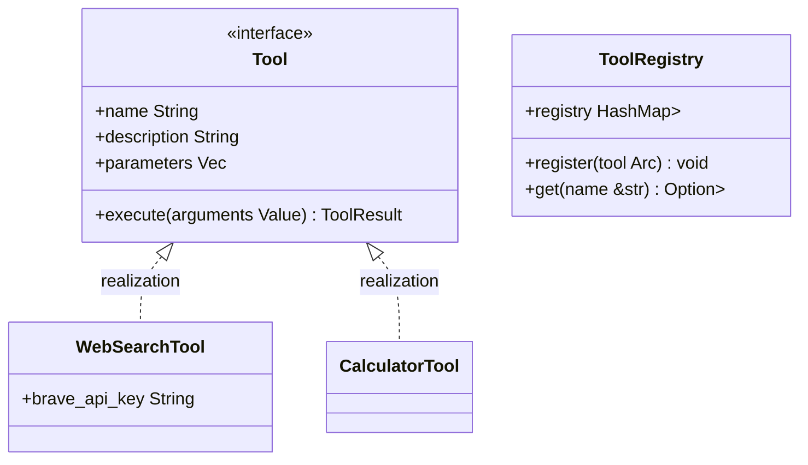

<spec>

# cclab-nova-tools Specification

## Overview

Tool registry and execution framework. Provides a set of standard tools for agents to interact with the world, including web search, calculations, and code execution.

## Requirements

### R1 - Web Search Tool

```yaml
id: R1
priority: high
status: draft
```

Implement a Web Search tool (e.g., using Brave Search API) for agents to fetch real-time information.

### R2 - Calculator Tool

```yaml
id: R2
priority: medium
status: draft
```

Implement a safe mathematical expression evaluator tool.

### R3 - Python REPL Tool

```yaml
id: R3
priority: high
status: draft
```

Implement a Python REPL tool that can execute code snippets (with proper sandboxing/isolation).

## Acceptance Criteria

### Scenario: Search for latest news

- **GIVEN** An agent with access to the WebSearchTool.
- **WHEN** The agent is asked about current events.
- **THEN** The tool returns a list of search results which the agent uses to answer.

### Scenario: Complex calculation

- **GIVEN** An agent with access to the CalculatorTool.
- **WHEN** The agent needs to evaluate a complex math expression.
- **THEN** The tool returns the correct numerical result.

## Flow Diagram



</spec>
