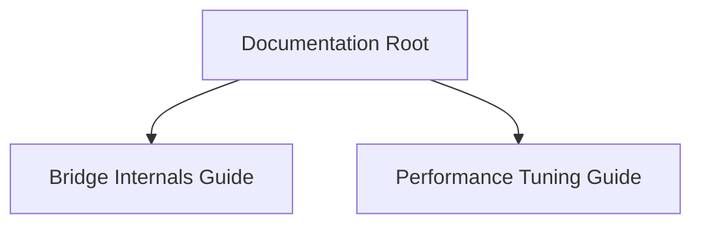

<spec>

# Orbit Documentation

## Overview

This specification covers the documentation requirements for cclab-orbit, specifically focusing on the Tokio-Asyncio bridge internals and a performance tuning guide for production deployments.

## Requirements

### R1 - Bridge Internals Documentation

```yaml
id: R1
priority: medium
status: draft
```

Document the internal architecture of the Tokio-Asyncio bridge, including waker implementation and task scheduling.

### R2 - Performance Tuning Guide

```yaml
id: R2
priority: medium
status: draft
```

Provide a performance tuning guide with recommendations for batch sizes, worker threads, and OS-level optimizations.

## Acceptance Criteria

### Scenario: Doc Accessibility

- **WHEN** A user looks for technical documentation in the project.
- **THEN** The documents are clearly visible in the docs/ directory.

## Diagrams

### Documentation Structure



</spec>
