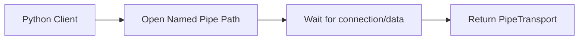

<spec>

# Orbit Named Pipes Support

## Overview

This specification covers the implementation of Named Pipes support in cclab-orbit for both Unix and Windows. It provides asyncio-compatible Pipe transports for high-performance inter-process communication.

## Requirements

### R1 - Windows Named Pipe Support

```yaml
id: R1
priority: high
status: draft
```

Implement NamedPipeTransport for Windows using Tokio's Windows Named Pipes.

### R2 - Unix Compatibility

```yaml
id: R2
priority: high
status: draft
```

Ensure compatibility with Unix domain sockets via NamedPipeTransport abstraction.

### R3 - Named Pipe API

```yaml
id: R3
priority: high
status: draft
```

Expose create_pipe_connection and create_pipe_server in PyLoop.

### R4 - Path and Permission Handling

```yaml
id: R4
priority: medium
status: draft
```

Handle platform-specific path formats and permission models.

## Acceptance Criteria

### Scenario: Windows Named Pipe Client

- **WHEN** A Python application on Windows connects to a named pipe path (\\.\pipe\...).
- **THEN** The client connects and can send/receive data via PipeTransport.

### Scenario: Named Pipe Server

- **WHEN** A Python application creates a named pipe server on a specific path.
- **THEN** The server listens on the pipe path and accepts incoming connections.

### Scenario: Cross-platform abstraction

- **WHEN** A user uses create_pipe_connection with a path that exists on the current platform.
- **THEN** The same code works on both Unix and Windows (mapping to UDS on Unix).

## Diagrams

### Named Pipe Connection Flow



</spec>
