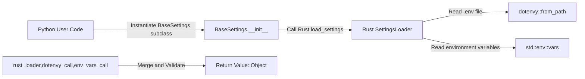

<spec>

# Shield Settings Management

## Overview

This specification covers the implementation of Settings Management in cclab-shield, providing a BaseSettings class that can load configuration from environment variables and .env files.

## Requirements

### R1 - Load from Environment Variables

```yaml
id: R1
priority: medium
status: draft
```

BaseSettings should load values from environment variables by matching field names (case-insensitive by default).

### R2 - Support .env files

```yaml
id: R2
priority: medium
status: draft
```

Support loading from .env files using the dotenvy crate in Rust.

### R3 - Environment Prefix Support

```yaml
id: R3
priority: medium
status: draft
```

Allow defining an environment variable prefix (e.g., APP_) to avoid collisions.

### R4 - Validation Integration

```yaml
id: R4
priority: medium
status: draft
```

Settings should be validated using the same engine as BaseModel.

## Acceptance Criteria

### Scenario: Load from ENV with prefix

- **GIVEN** An environment variable APP_DATABASE_URL=postgres://localhost:5432 is set.
- **WHEN** A Settings class with env_prefix='APP_' is instantiated.
- **THEN** The settings instance should have database_url attribute set correctly.

### Scenario: Load from .env file

- **GIVEN** A .env file with DEBUG=true is present.
- **WHEN** The Settings class is instantiated.
- **THEN** The settings instance should have debug=True.

### Scenario: Ignore extra env vars

- **GIVEN** An env var MY_SETTING=value is set but not defined in the class.
- **WHEN** The Settings class is instantiated.
- **THEN** The extra variable should be ignored without error.

### Scenario: Validation failure in settings

- **GIVEN** An env var PORT=abc is set for an int field.
- **WHEN** The Settings class is instantiated.
- **THEN** A ValidationError should be raised during instantiation.

## Diagrams

### Settings Loading Flow



</spec>
