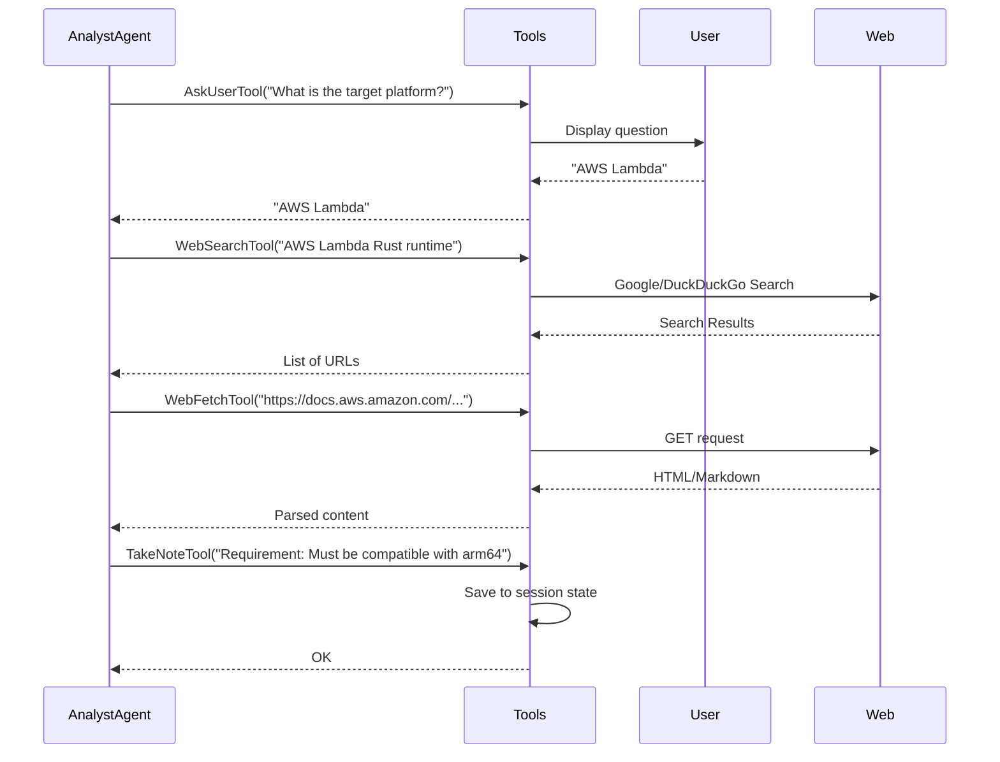

<spec>

# Analysis Tools Specification

## Overview

This spec defines a set of tools specifically designed for requirements analysis and research. These tools enable the Analyst Agent to gather information from the web, interact with the user for clarifications, and manage analysis notes.

## Requirements

### R1 - AskUserTool

```yaml
id: R1
priority: medium
status: draft
```

A tool that allows the agent to pause execution and ask the user for clarification or additional information.

### R2 - TakeNoteTool

```yaml
id: R2
priority: medium
status: draft
```

A tool for recording findings, assumptions, and key requirements during the analysis process. Notes should be persistent within the session.

### R3 - WebSearchTool

```yaml
id: R3
priority: medium
status: draft
```

A tool to perform web searches to research technical solutions, libraries, or domain-specific information.

### R4 - WebFetchTool

```yaml
id: R4
priority: medium
status: draft
```

A tool to retrieve and parse the content of a specific web page or documentation site.

## Acceptance Criteria

### Scenario: User Clarification

- **GIVEN** Agent needs more info from user
- **WHEN** the agent uses AskUserTool.
- **THEN** the execution should suspend until the user provides a response, which is then returned to the agent.

### Scenario: Researching Technical Details

- **GIVEN** Agent needs to research a topic
- **WHEN** the agent uses WebSearchTool followed by WebFetchTool.
- **THEN** it should receive relevant search results and then the full content of a selected result.

### Scenario: Persistent Note Taking

- **GIVEN** Agent finds important information
- **WHEN** the agent uses TakeNoteTool.
- **THEN** the note should be added to the agent's internal state and be available for the duration of the session.

## Flow Diagram



</spec>
