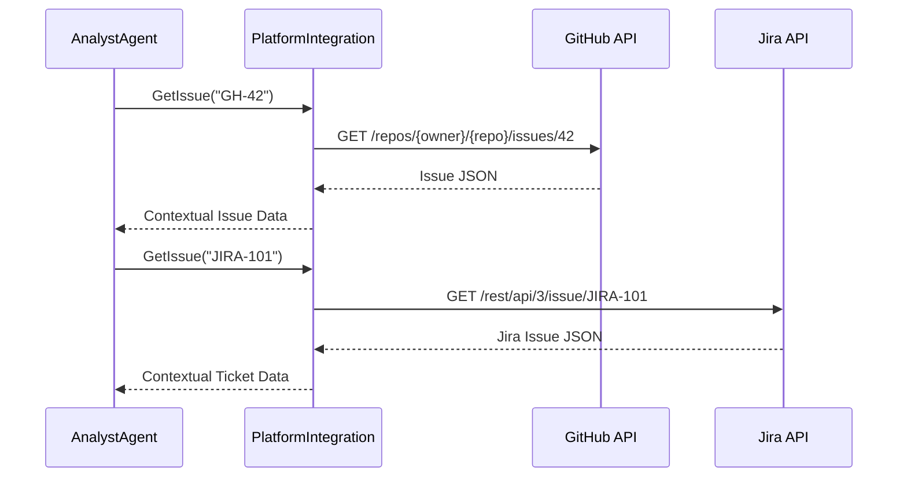

<spec>

# Platform Integrations Specification

## Overview

Platform Integrations allow the Analyst Agent to connect with external project management tools and issue trackers. This enables the agent to read issue descriptions, comments, and project metadata, providing rich context for requirements analysis.

## Requirements

### R1 - PlatformIntegration Trait

```yaml
id: R1
priority: medium
status: draft
```

Define a PlatformIntegration trait that abstracts common operations for issue trackers, such as fetching an issue by ID and listing issues in a project.

### R2 - GitHub Integration

```yaml
id: R2
priority: medium
status: draft
```

Implement integration with the GitHub API to fetch issue details, comments, and repository information.

### R3 - GitLab Integration

```yaml
id: R3
priority: medium
status: draft
```

Implement integration with the GitLab API for fetching issues and project context.

### R4 - Jira Integration

```yaml
id: R4
priority: medium
status: draft
```

Implement integration with the Jira REST API to fetch ticket details, sub-tasks, and comments.

### R5 - Secure Credential Management

```yaml
id: R5
priority: medium
status: draft
```

Platform integrations must support secure configuration of API tokens and credentials, potentially through environment variables or a configuration manager.

## Acceptance Criteria

### Scenario: GitHub Context Retrieval

- **GIVEN** the agent is configured with a valid GitHub token and repository.
- **WHEN** the agent calls get_issue.
- **THEN** it should be able to retrieve the full description and all comments for a given issue ID.

### Scenario: Multi-Platform Search

- **GIVEN** Multiple platforms are configured
- **WHEN** listing issues across multiple configured platforms.
- **THEN** it should return a unified list of results from all active integrations.

### Scenario: Credential Error Handling

- **GIVEN** a platform integration is used with invalid credentials.
- **WHEN** the agent attempts to fetch data.
- **THEN** it should return a clear NovaError::AuthError and inform the user.

## Flow Diagram



</spec>
