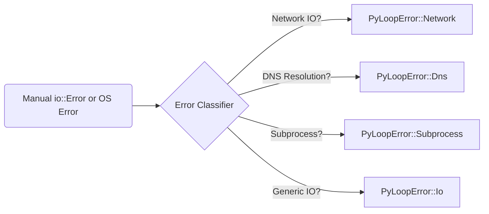

<spec>

# Structured Error Handling

## Overview

This specification defines a structured error handling strategy for cclab-orbit using the thiserror crate. It replaces manual io::Error constructions with domain-specific error enums to improve observability and robustness.

## Requirements

### R1 - Consolidated Error Enum

```yaml
id: R1
priority: medium
status: draft
```

Expand the PyLoopError enum in crates/cclab-orbit/src/error.rs using thiserror to include specific variants for Network, DNS, Subprocess, and Timer domains.

### R2 - Error Refactoring

```yaml
id: R2
priority: medium
status: draft
```

Replace all instances of manual io::Error::new(Other, ...) with specific PyLoopError variants across the codebase.

### R3 - Rich Error Context

```yaml
id: R3
priority: medium
status: draft
```

Ensure all error variants provide clear, actionable messages and correctly wrap underlying OS errors where applicable.

### R4 - Error Conversions

```yaml
id: R4
priority: medium
status: draft
```

Implement Conversion traits (From<io::Error>, etc.) to allow seamless error propagation with the ? operator.

## Acceptance Criteria

### Scenario: Structured Network Error

- **GIVEN** A network connection fails.
- **WHEN** The operation fails.
- **THEN** The error is returned as PyLoopError::Network(NetworkError::ConnectionRefused).

### Scenario: Structured DNS Error

- **GIVEN** A hostname cannot be resolved.
- **WHEN** DNS lookup fails.
- **THEN** The error is returned as PyLoopError::Dns(DnsError::ResolutionFailed).

### Scenario: Wrapped IO Error

- **GIVEN** An OS error occurs.
- **WHEN** A file operation fails.
- **THEN** The OS error is wrapped in PyLoopError::Io and includes the original context.

### Scenario: Structured Subprocess Error

- **GIVEN** A subprocess fails to start.
- **WHEN** Spawning a child process.
- **THEN** The error is returned as PyLoopError::Subprocess(SubprocessError::ProcessNotFound).

## Diagrams

### Error Classification Flow



## Data Model

```json
{
  "properties": {
    "code": {
      "description": "Error code string",
      "type": "string"
    },
    "message": {
      "description": "Human-readable error message",
      "type": "string"
    },
    "source": {
      "description": "Underlying error source (optional)",
      "type": "string"
    }
  },
  "required": [
    "code",
    "message"
  ],
  "type": "object"
}
```

</spec>
