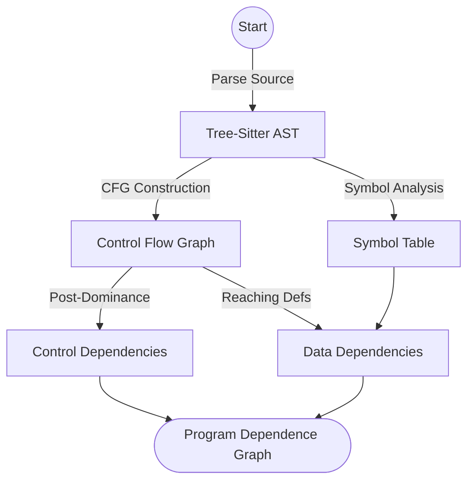

<spec>

# Python Program Dependence Graph Core

## Overview

This specification defines the implementation of a statement-level Program Dependence Graph (PDG) for Python code analysis. The PDG combines control dependencies (derived from the Control Flow Graph and Post-Dominator Tree) and data dependencies (derived from def-use chains and reaching definitions) to provide a comprehensive representation of program semantics. This enables advanced analyses like program slicing, impact analysis, and taint tracking.

## Requirements

### R1 - Statement-level CFG Construction

```yaml
id: R1
priority: medium
status: draft
```

Implement a statement-level CFG for Python in 'crates/cclab-prism/src/semantic/pdg/cfg.rs' that handles sequential execution, if-else branches, loops (for/while), exceptions (try/except/finally), and function calls.

### R2 - Control Dependency Analysis

```yaml
id: R2
priority: medium
status: draft
```

Construct the Post-Dominator Tree in 'crates/cclab-prism/src/semantic/pdg/dominator.rs' from the CFG to identify control dependencies between statements.

### R3 - Data Dependency Analysis

```yaml
id: R3
priority: medium
status: draft
```

Track reaching definitions and build def-use chains in 'crates/cclab-prism/src/semantic/pdg/data_flow.rs' for all variables to identify data dependencies.

### R4 - Unified PDG Representation

```yaml
id: R4
priority: medium
status: draft
```

Combine control and data dependencies into a unified Program Dependence Graph (PDG) in 'crates/cclab-prism/src/semantic/pdg/mod.rs' where nodes are statements and edges represent dependencies.

### R5 - Program Slicing Algorithms

```yaml
id: R5
priority: medium
status: draft
```

Implement algorithms for forward and backward program slicing in 'crates/cclab-prism/src/semantic/pdg/mod.rs' by traversing the PDG.

### R6 - Change Impact Analysis

```yaml
id: R6
priority: medium
status: draft
```

Provide impact analysis by computing the forward slice of modified statements to identify affected downstream code.

### R7 - Security Taint Tracking

```yaml
id: R7
priority: medium
status: draft
```

Implement taint tracking by identifying paths in the PDG from untrusted sources to sensitive sinks.

### R8 - Inter-procedural Analysis

```yaml
id: R8
priority: medium
status: draft
```

Support inter-procedural analysis by linking call sites to function definitions and tracking dependencies across function boundaries.

## Acceptance Criteria

### Scenario: PDG Construction for Simple Branch

- **GIVEN** A Python function with an if-statement and a variable assignment.
- **WHEN** The PDG analysis is run on the function.
- **THEN** The PDG should show that the assignment in the 'if' block is control-dependent on the if-condition and data-dependent on any prior definitions of variables used in the assignment.

### Scenario: Backward Slicing from a Statement

- **GIVEN** A statement in a Python script.
- **WHEN** A backward slice is requested for that statement.
- **THEN** The analyzer returns all statements that directly or indirectly influence the value or execution of the target statement.

### Scenario: Taint Tracking from Source to Sink

- **GIVEN** A set of untrusted input sources (e.g., request parameters) and sensitive sinks (e.g., database queries).
- **WHEN** Taint analysis is run on the project.
- **THEN** The analyzer identifies all paths in the PDG where data from a source can reach a sink without being sanitized.

## Diagrams

### PDG Construction Pipeline



</spec>
