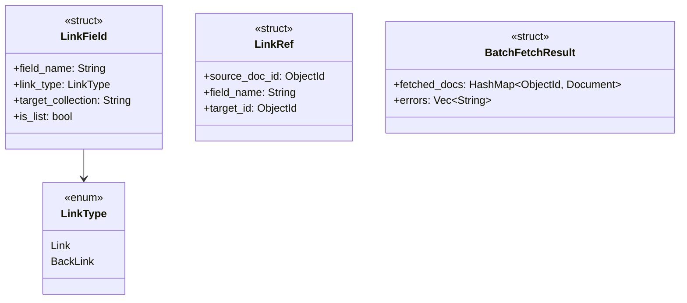

<spec>

# Link Fetching \u985e\u578b\u8a2d\u8a08

## Overview

\u5b9a\u7fa9 Rust \u7aef\u7684 LinkField \u548c LinkRef \u985e\u578b\uff0c\u7528\u65bc\u8868\u793a document \u4e4b\u9593\u7684\u95dc\u806f\u3002\u652f\u63f4 Link (single) \u548c BackLink (reverse) \u985e\u578b\u3002\u63d0\u4f9b batch query \u548c recursive depth \u8655\u7406\u3002

## Requirements

### R1 - LinkField struct

```yaml
id: R1
priority: high
status: draft
```

定義 LinkField struct 包含: field_name (String), link_type (LinkType enum), target_collection (String), is_list (bool)

### R2 - LinkType enum

```yaml
id: R2
priority: high
status: draft
```

定義 LinkType enum 包含: Link (forward reference), BackLink (reverse reference)

### R3 - LinkRef struct

```yaml
id: R3
priority: high
status: draft
```

定義 LinkRef struct 包含: source_doc_id (ObjectId), field_name (String), target_id (ObjectId)

### R4 - BatchFetchResult

```yaml
id: R4
priority: medium
status: draft
```

定義 BatchFetchResult 包含: fetched_docs (HashMap<ObjectId, BsonDocument>), errors (Vec<String>)

## Acceptance Criteria

### Scenario: 建立 LinkField

- **GIVEN** 需要描述 document 關聯
- **WHEN** 建立 LinkField::new("author", LinkType::Link, "users")
- **THEN** 產生正確的 LinkField 結構

### Scenario: 收集 refs

- **GIVEN** 多個 documents 包含 link fields
- **WHEN** 遍歷收集所有 refs
- **THEN** 產生 HashMap<collection, Vec<LinkRef>>

## Flow Diagram


```

## API Specification (JSON Schema)

```yaml
$schema: https://json-schema.org/draft/2020-12/schema
properties:
  field_name:
    type: string
  is_list:
    type: boolean
  link_type:
    enum:
    - link
    - backlink
  target_collection:
    type: string
required:
- field_name
- link_type
- target_collection
title: LinkField
type: object
```

</spec>
