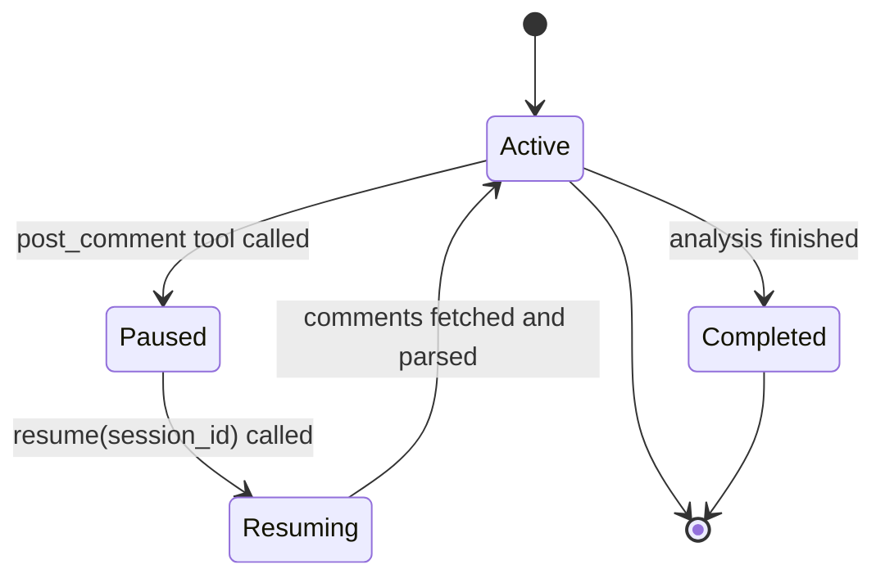

<spec>

# AnalystAgent Async Workflow

## Overview

This spec defines the enhancements to AnalystAgent to support async workflows, session persistence of LLM history, and resume capabilities.

## Requirements

### R1 - Message History Persistence

```yaml
id: R1
priority: high
status: draft
```

SessionState must persist the full list of Message objects from ContextManager.

### R2 - Session Resume Capability Check

```yaml
id: R2
priority: high
status: draft
```

AnalystAgent must be able to resume a session by loading the message history into its ContextManager.

### R3 - Execution Pause State

```yaml
id: R3
priority: high
status: draft
```

AnalystAgent must support a pause state when waiting for external input via platform comments.

### R4 - Contextual Resume

```yaml
id: R4
priority: medium
status: draft
```

AnalystAgent must be able to fetch new comments from the integrated platform and add them as context during resume.

## Acceptance Criteria

### Scenario: Save and load message history

- **GIVEN** An AnalystAgent session with 5 messages is saved to storage
- **WHEN** The session is loaded by ID
- **THEN** The loaded session contains all 5 messages in its ContextManager

### Scenario: Resume session with new comment

- **GIVEN** An AnalystAgent is in Paused state waiting for GitHub issue #123
- **WHEN** resume() is called with the session ID
- **THEN** The agent fetches the new comment, adds it to context, and continues execution

## Flow Diagram



</spec>
