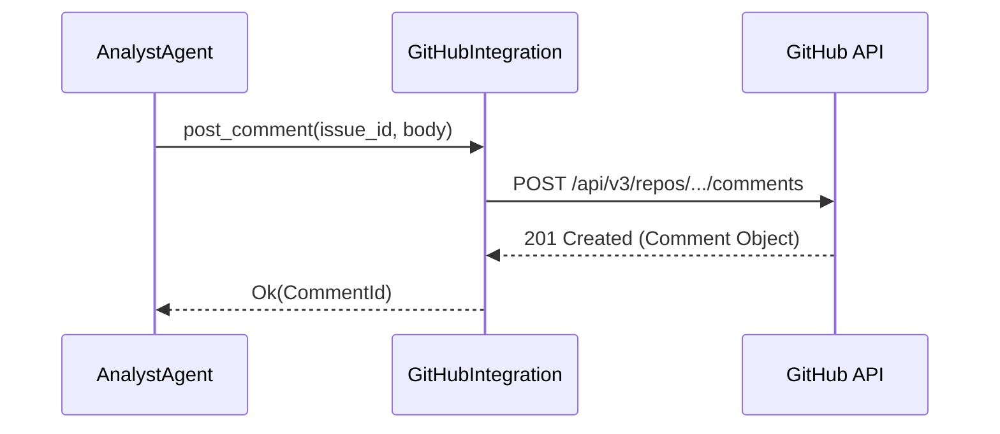

<spec>

# Platform Commenting Integration

## Overview

This spec defines the enhancements to platform integrations to support posting comments and parsing responses. It extends the PlatformIntegration trait to allow AnalystAgent to communicate with stakeholders on external platforms like GitHub, GitLab, and Jira.

## Requirements

### R1 - Post Comment Method

```yaml
id: R1
priority: high
status: draft
```

The PlatformIntegration trait must include a method to post a comment to an issue or ticket.

### R2 - Platform Implementations

```yaml
id: R2
priority: high
status: draft
```

The GitHub, GitLab, and Jira integrations must implement the post_comment method using their respective APIs.

### R3 - Comment Response Parsing

```yaml
id: R3
priority: medium
status: draft
```

The system must be able to parse markdown comments to extract checked checkboxes ([x]) and accompanying text.

## Acceptance Criteria

### Scenario: Post comment to GitHub issue

- **GIVEN** A GitHub integration is configured
- **WHEN** post_comment is called with issue_id and body
- **THEN** A comment is posted to the GitHub issue via the API

### Scenario: Parse checkbox response

- **GIVEN** A markdown comment with checkboxes: '- [ ] Opt 1\n- [x] Opt 2\nSome feedback'
- **WHEN** The comment is parsed by the utility
- **THEN** The result indicates 'Opt 2' is selected and 'Some feedback' is the text reply

## Flow Diagram



</spec>
