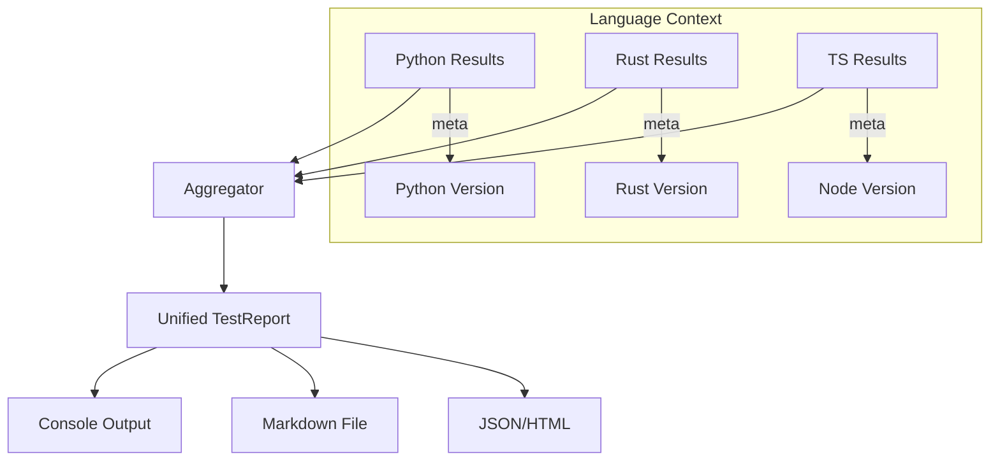

<spec>

# Multi-lang Unified Reporting

## Overview

This specification defines the enhancements to the cclab-probe reporting engine to support multi-language projects. It ensures that results from Python, Rust, and TypeScript are unified into a single report while preserving language-specific details.

## Requirements

### R1 - Language-based Grouping

```yaml
id: R1
priority: medium
status: draft
```

Test results must be grouped by language in the final report to provide clear visibility into different components.

### R2 - Multi-language Environment Info

```yaml
id: R2
priority: medium
status: draft
```

The report must include relevant toolchain information for all detected languages (e.g., rustc --version, node --version).

### R3 - Cross-language Aggregation

```yaml
id: R3
priority: medium
status: draft
```

The total summary must aggregate counts (passed, failed, duration) across all languages.

### R4 - Detailed Language Metrics

```yaml
id: R4
priority: medium
status: draft
```

Detailed metrics unique to a language (e.g., V8 heap for TS, GIL contention for Python) must be rendered in language-specific sections.

## Acceptance Criteria

### Scenario: Generate mixed language report

- **WHEN** The user runs 'dbtest' on a project containing Python, Rust, and TS code.
- **THEN** The report should show three distinct sections for Python, Rust, and TypeScript with their respective results.

### Scenario: Single language fallback

- **WHEN** The user runs 'dbtest' on a pure Rust project.
- **THEN** The report should only show the relevant language section without empty placeholders for others.

### Scenario: Aggregated Summary

- **WHEN** A test run finishes with 5 Python tests, 5 Rust tests, and 5 TS tests.
- **THEN** The top-level summary should show the total number of tests and the overall pass rate correctly.

## Flow Diagram



</spec>
