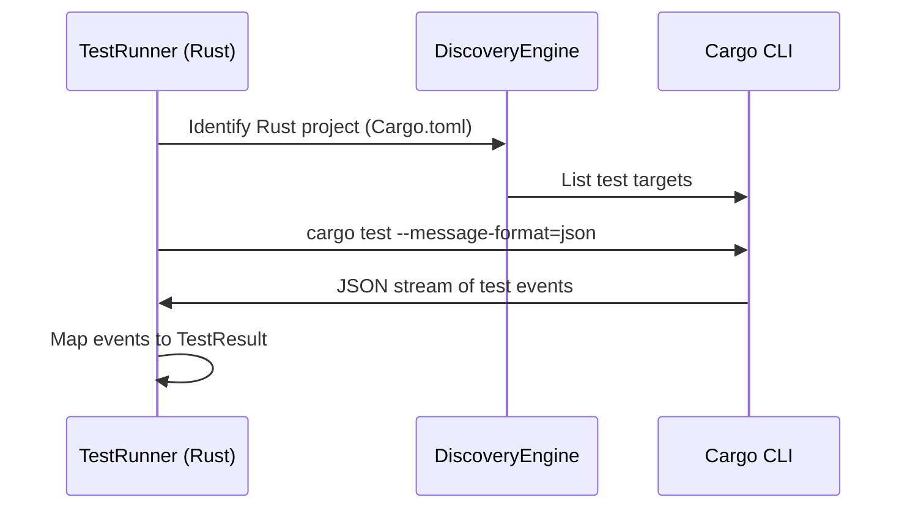

<spec>

# Rust Runner Integration

## Overview

This specification defines the integration between cclab-probe and the Rust toolchain (Cargo) to provide seamless testing, benchmarking, and security scanning for Rust-based components.

## Requirements

### R1 - Project Detection

```yaml
id: R1
priority: medium
status: draft
```

The probe must automatically identify Rust projects by detecting Cargo.toml files in the search path.

### R2 - Test Execution Integration

```yaml
id: R2
priority: medium
status: draft
```

Unit and integration tests must be executed using 'cargo test --message-format=json' to allow structured parsing of results.

### R3 - Benchmark Integration

```yaml
id: R3
priority: medium
status: draft
```

Performance benchmarks must be supported by integrating with 'cargo bench' and parsing Criterion/libtest output.

### R4 - Security Integration (Fuzzing)

```yaml
id: R4
priority: medium
status: draft
```

Security testing must support 'cargo-fuzz' for coverage-guided fuzzing of Rust functions.

### R5 - Rust Metrics Collection

```yaml
id: R5
priority: medium
status: draft
```

Rust-specific metrics such as peak memory usage (RSS) and thread count must be captured during execution.

## Acceptance Criteria

### Scenario: Run standard unit tests

- **WHEN** The user runs 'dbtest' on a Rust project with 5 passing unit tests.
- **THEN** The runner should return a TestSummary indicating 5 passed tests and 0 failures.

### Scenario: Handle compilation failure

- **WHEN** The user runs 'dbtest' on a Rust project that has syntax errors.
- **THEN** The runner should report a 'TestStatus::Error' with the cargo compilation error message.

### Scenario: Run Criterion benchmarks

- **WHEN** The user runs 'dbtest --type profile' on a Rust project with Criterion benchmarks.
- **THEN** The runner should capture the average iteration time and peak memory usage for the benchmark.

## Flow Diagram



</spec>
