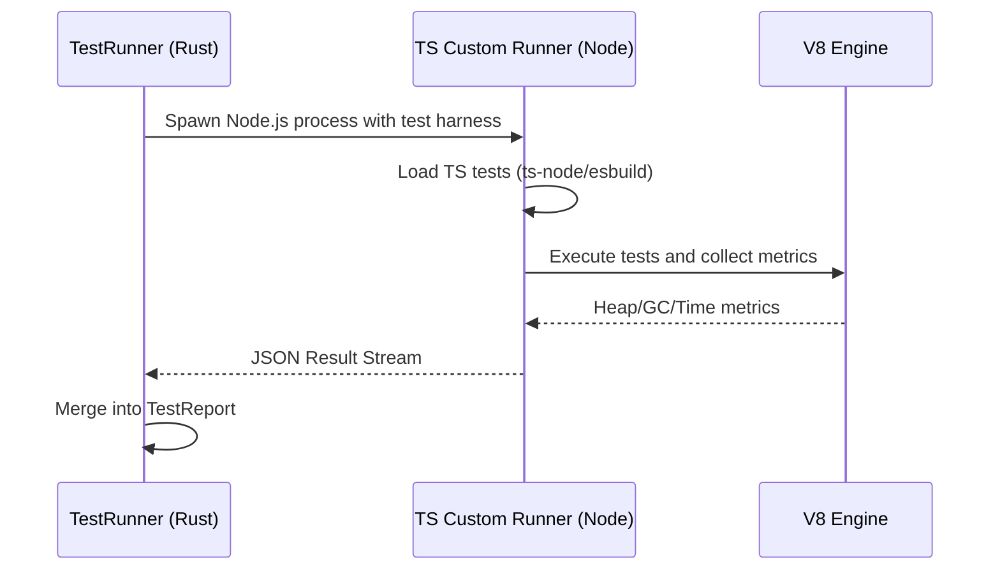

<spec>

# TypeScript Custom Runner

## Overview

This specification defines a custom TypeScript runner that integrates with the cclab-probe Rust engine. It enables functional testing, performance profiling (V8 metrics), and security scanning for TypeScript and JavaScript applications.

## Requirements

### R1 - Project Detection

```yaml
id: R1
priority: medium
status: draft
```

The probe must automatically identify TypeScript projects by detecting package.json or tsconfig.json files.

### R2 - Custom TS Runner

```yaml
id: R2
priority: medium
status: draft
```

TypeScript tests must be executed using a high-performance harness that supports lazy loading and parallel execution.

### R3 - V8 Metrics Collection

```yaml
id: R3
priority: medium
status: draft
```

Performance tests must capture V8-specific metrics including heap usage, garbage collection events, and event loop lag.

### R4 - TS Benchmark Integration

```yaml
id: R4
priority: medium
status: draft
```

Benchmarking must be supported through integration with common TS benchmarking patterns (e.g., mitata, tinybench).

### R5 - TS Security Suite

```yaml
id: R5
priority: medium
status: draft
```

Security testing must include payloads and checkers for common Node.js/TS vulnerabilities such as prototype pollution and injection.

## Acceptance Criteria

### Scenario: Run TS unit tests

- **WHEN** The user runs 'dbtest' on a TypeScript project with 10 unit tests.
- **THEN** The runner should return a TestSummary indicating 10 passed tests.

### Scenario: V8 Profiling

- **WHEN** The user runs 'dbtest --type profile' on a TS service.
- **THEN** The report should include a 'v8_heap_usage' metric and GC frequency.

### Scenario: Detect Injection in TS

- **WHEN** The user runs 'dbtest --type security' on a TS function vulnerable to SQL injection.
- **THEN** The runner should report a 'SecurityViolation' for the vulnerable code path.

## Flow Diagram



</spec>
