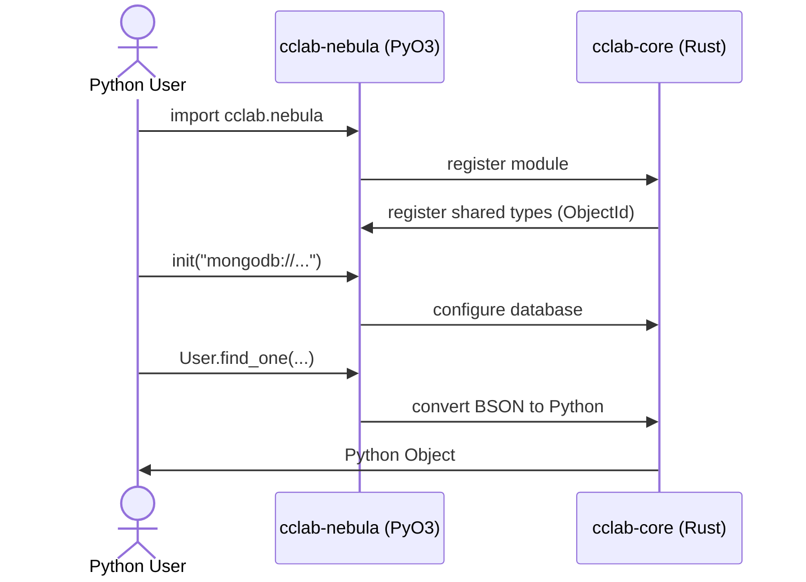

<spec>

# Nucleus PyO3 Migration Architecture

## Overview

This specification outlines the architectural changes required to migrate PyO3 bindings from the monolithic `cclab-nucleus` crate to individual feature crates (`cclab-nebula`, `cclab-photon`, etc.) and `cclab-core`.

The goal is to decouple the Python bindings, allowing each crate to manage its own Python exposure, improving build times, modularity, and alignment with the `cclab-shield` pattern. `cclab-nucleus` will be deprecated and removed, replaced by direct usage of these individual crates (likely as namespace packages or standalone modules).

## Requirements

### R1 - Shared Core Bindings

```yaml
id: R1
priority: medium
status: draft
```

Move shared Python integration logic (BSON conversion, core types, error handling, config) from `cclab-nucleus` to `cclab-core` behind a `python` feature flag.

### R2 - Nebula Bindings

```yaml
id: R2
priority: medium
status: draft
```

Implement `pyo3_bindings` module in `cclab-nebula` exposing MongoDB/Document ORM functionality, replacing `cclab-nucleus/src/nebula`.

### R3 - Photon Bindings

```yaml
id: R3
priority: medium
status: draft
```

Implement `pyo3_bindings` module in `cclab-photon` exposing HTTP client functionality, replacing `cclab-nucleus/src/http`.

### R4 - Ion Bindings

```yaml
id: R4
priority: medium
status: draft
```

Implement `pyo3_bindings` module in `cclab-ion` exposing KV store functionality, replacing `cclab-nucleus/src/kv`.

### R5 - Meteor Bindings

```yaml
id: R5
priority: medium
status: draft
```

Implement `pyo3_bindings` module in `cclab-meteor` exposing Task queue functionality, replacing `cclab-nucleus/src/tasks`.

### R6 - Nova Bindings

```yaml
id: R6
priority: medium
status: draft
```

Implement `pyo3_bindings` module in `cclab-nova` exposing Agent functionality, replacing `cclab-nucleus/src/agent`.

### R7 - Probe Bindings

```yaml
id: R7
priority: medium
status: draft
```

Implement `pyo3_bindings` module in `cclab-probe` exposing QC/Test functionality, replacing `cclab-nucleus/src/qc`.

### R8 - Orbit Bindings

```yaml
id: R8
priority: medium
status: draft
```

Implement `pyo3_bindings` module in `cclab-orbit` exposing PyLoop/Runtime functionality, replacing `cclab-nucleus/src/pyloop`.

### R9 - Deprecate Nucleus

```yaml
id: R9
priority: medium
status: draft
```

Remove `cclab-nucleus` crate and update workspace configuration to reflect its removal.

### R10 - Fix Genesis Spec Path Verification

```yaml
id: R10
priority: high
status: draft
```

Fix `proposal_engine.rs:673` to support `target_crate` subdirectories when verifying spec file creation. Currently checks `specs/{spec_id}.md` but should search `specs/**/{spec_id}.md` to find specs in subdirectories like `specs/cclab-nebula/`.

### R11 - Fix Genesis Task Generator Recursive Scan

```yaml
id: R11
priority: high
status: draft
```

Fix `task_generator.rs:596` to recursively scan `specs/` subdirectories. Currently only reads direct files under `specs/`, missing specs in `target_crate` subdirectories.

## Acceptance Criteria

### Scenario: Nebula Usage

- **WHEN** A Python script imports `Document` and `init` from the new `cclab-nebula` binding (e.g., `cclab.nebula`) and connects to MongoDB.
- **THEN** The Python script successfully inserts and retrieves the document using the new binding location.

### Scenario: Shared Type Conversion

- **WHEN** A PyO3 module in `cclab-nebula` attempts to convert a Rust `Document` to a Python dictionary using `cclab-core` utilities.
- **THEN** The BSON conversion logic in `cclab-core` correctly handles the serialization without errors.

### Scenario: Mixed Usage

- **WHEN** A Python script uses `cclab-nebula` to fetch data and `cclab-photon` to send it via HTTP.
- **THEN** Both modules operate correctly, sharing the same underlying `cclab-core` types (e.g., `ObjectId`) without type mismatch errors.

### Scenario: Spec Path with target_crate

- **GIVEN** A spec with `target_crate: cclab-nebula` creating file at `specs/cclab-nebula/nebula-bindings.md`.
- **WHEN** `cclab gen plan-change` verifies spec creation.
- **THEN** The verification succeeds by finding the spec in the subdirectory.

### Scenario: Task Generation with Subdirectories

- **GIVEN** Specs exist in `specs/cclab-nebula/` and `specs/cclab-ion/` subdirectories.
- **WHEN** `cclab gen plan-change` generates tasks.
- **THEN** Tasks are generated for all specs in all subdirectories.

## Diagrams

### Module Initialization & Usage Flow



</spec>
