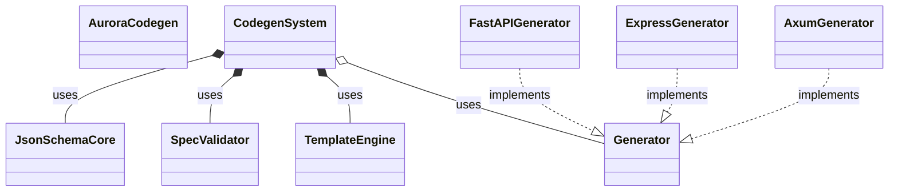

<spec>

# Aurora Code Generation System Architecture

## Overview

Defines the architecture for the Aurora Code Generation System. This system allows generating production-ready code for various frameworks (FastAPI, Express, Axum) from JSON Schema/OpenAPI specifications using a template-based engine. It includes validation, testing, and modular generators.

## Requirements

### R1 - Unified Internal Representation

```yaml
id: R1
priority: medium
status: draft
```

The system must parse JSON Schema and OpenAPI specifications into a unified internal representation based on JSON Schema.

### R2 - Spec Validation

```yaml
id: R2
priority: medium
status: draft
```

The system must validate the input specification for completeness (e.g., missing types, descriptions) before generation.

### R3 - Template-Based Generation

```yaml
id: R3
priority: medium
status: draft
```

The system must use a template engine (e.g., MiniJinja) to generate code, allowing for customizable templates.

### R4 - Pluggable Generators

```yaml
id: R4
priority: medium
status: draft
```

The system must support pluggable generators for different frameworks (FastAPI, Express, Axum).

### R5 - Test Generation

```yaml
id: R5
priority: medium
status: draft
```

The system must generate corresponding test suites for the generated code.

## Acceptance Criteria

### Scenario: Generate FastAPI Code

- **GIVEN** A valid JSON Schema for a User model
- **WHEN** The FastAPI generator is invoked
- **THEN** FastAPI Pydantic models and API endpoints are generated using the FastAPI templates

### Scenario: Validation Failure

- **GIVEN** An incomplete spec missing a required field type
- **WHEN** The spec is validated
- **THEN** The system returns a validation error detailing the missing type

### Scenario: Generate Axum Code

- **GIVEN** A valid OpenAPI spec
- **WHEN** The Axum generator is invoked
- **THEN** Axum handlers and structs are generated using the Axum templates

## Diagrams

### Aurora Codegen System Class Diagram



### Aurora Codegen Data Flow

```mermaid
flowchart LR
    InputSpec[Input Spec (JSON/YAML)]
    JsonSchemaCore(JSON Schema Core)
    SpecValidator{Spec Validator} 
    TemplateEngine(Template Engine)
    Generators(Framework Generators)
    TestGenerator(Test Generator)
    GeneratedCode[Generated Code]
    GeneratedTests[Generated Tests]
    InputSpec -->|Parse| JsonSchemaCore
    JsonSchemaCore -->|Validate| SpecValidator
    SpecValidator -->|Valid| TemplateEngine
    TemplateEngine -->|Render| Generators
    Generators -->|Output| GeneratedCode
    Generators -.->|Generate| TestGenerator
    TestGenerator -->|Output| GeneratedTests
```

</spec>
