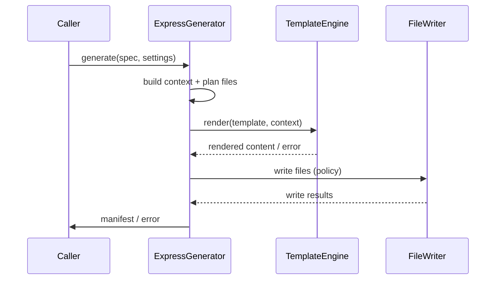

---
id: generator-express
type: spec
title: "Express Generator"
version: 1
spec_type: integration
main_spec_ref: aurora-codegen-system
merge_strategy: replace
created_at: 2026-02-02T14:17:22.328028+00:00
updated_at: 2026-02-02T14:17:22.328028+00:00
requirements:
  total: 5
  ids:
    - R1
    - R2
    - R3
    - R4
    - R5
design_elements:
  has_mermaid: true
  has_json_schema: false
  has_pseudo_code: false
  has_api_spec: false
  has_semantic_diagrams: false
  diagrams:
    - type: sequence
      title: "Express Generation Flow"
history:
  - timestamp: 2026-02-02T14:17:22.328028+00:00
    agent: "mcp"
    tool: "create_spec"
    action: "created"
  - timestamp: 2026-02-02T14:17:26.176889+00:00
    agent: "codex:deep"
    tool: "revise_spec"
    action: "revised"
  - timestamp: 2026-02-02T14:17:44.109979+00:00
    agent: "codex:max"
    tool: "review_spec"
    action: "reviewed"---

<spec>

# Express Generator

## Overview

Defines the Express.js code generator that renders Express project files using the Tera-based template engine and produces a deterministic file manifest.

## Requirements

### R1 - Template Set Resolution

```yaml
id: R1
priority: high
status: draft
```

The Express generator resolves the Express template set from the templates root using a fixed subdirectory name (express/). If the directory is missing, the generator returns GeneratorError::TemplateSetMissing with the expected absolute path.

### R2 - Context Construction

```yaml
id: R2
priority: high
status: draft
```

The generator builds a template context from the normalized API/JSON Schema IR including routes, request/response models, and project settings (name, version, language target). The context must be deterministic for identical inputs.

### R3 - Deterministic Manifest

```yaml
id: R3
priority: medium
status: draft
```

The generator returns a manifest of all planned output files. The manifest entries are ordered by normalized relative path and include file status (written|skipped|error) and content hash when rendered.

### R4 - Overwrite Policy

```yaml
id: R4
priority: medium
status: draft
```

The generator supports overwrite policy values error|skip|overwrite. For each existing target file, the generator applies the policy and records the per-file outcome in the manifest; policy error must stop the run with GeneratorError::OverwriteNotAllowed naming the file.

### R5 - Error Mapping

```yaml
id: R5
priority: medium
status: draft
```

Template rendering errors and filesystem write errors are mapped into structured generator errors that include the failing template or file path.

## Acceptance Criteria

### Scenario: Generate Express Project

- **GIVEN** An API spec with two routes and generator settings { name: "todo-api", lang: "ts" }
- **WHEN** generate(spec, settings) is invoked
- **THEN** A manifest is returned containing rendered Express files under src/ plus package.json and tsconfig.json.

### Scenario: Missing Template Set

- **GIVEN** The templates root does not contain the express/ directory
- **WHEN** generate(spec, settings) is invoked
- **THEN** The call fails with GeneratorError::TemplateSetMissing including the expected path.

### Scenario: Stable Output Ordering

- **GIVEN** The same input spec and settings are used twice
- **WHEN** generate(spec, settings) is invoked both times
- **THEN** The manifest lists entries in identical path order and identical content hashes.

### Scenario: Overwrite Policy Skip

- **GIVEN** A target file already exists and overwrite policy is set to skip
- **WHEN** generate(spec, settings) is invoked
- **THEN** The manifest records the file as skipped and the file contents remain unchanged.

### Scenario: Overwrite Policy Error

- **GIVEN** A target file already exists and overwrite policy is set to error
- **WHEN** generate(spec, settings) is invoked
- **THEN** The call fails with GeneratorError::OverwriteNotAllowed naming the file.

### Scenario: Template Render Failure

- **GIVEN** A template with a syntax error in the express/ set
- **WHEN** generate(spec, settings) is invoked
- **THEN** The call fails with GeneratorError::TemplateRenderError naming the template.

## Diagrams

### Express Generation Flow



</spec>
