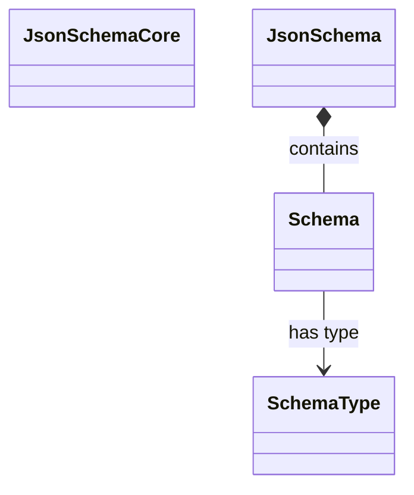

<spec>

# JSON Schema Core Implementation

## Overview

Defines the core JSON Schema structures and parsing logic for cclab-aurora. This module is responsible for parsing JSON Schema strings into a strongly-typed Rust structure that can be used by validators and generators.

## Requirements

### R1 - Version Support

```yaml
id: R1
priority: medium
status: draft
```

The module must support parsing Draft 7 and Draft 2020-12 JSON Schemas.

### R2 - Typed Structure

```yaml
id: R2
priority: medium
status: draft
```

The module must provide a strongly-typed structure for schemas, including handling of recursive definitions ($ref).

### R3 - Serde Integration

```yaml
id: R3
priority: medium
status: draft
```

The module must handle serialization and deserialization using Serde.

## Acceptance Criteria

### Scenario: Parse Draft 7 Schema

- **GIVEN** A valid Draft 7 JSON Schema string
- **WHEN** The parse function is called
- **THEN** It is successfully parsed into a JsonSchema struct

### Scenario: Handle Recursion

- **GIVEN** A JSON Schema with a circular $ref
- **WHEN** The schema is traversed
- **THEN** The structure preserves the reference or resolves it lazily

## Diagrams

### JSON Schema Core Class Diagram



## API Specification (JSON Schema)

```yaml
properties:
  definitions:
    type: object
  schema_version:
    type: string
title: JsonSchema
type: object
```

</spec>
