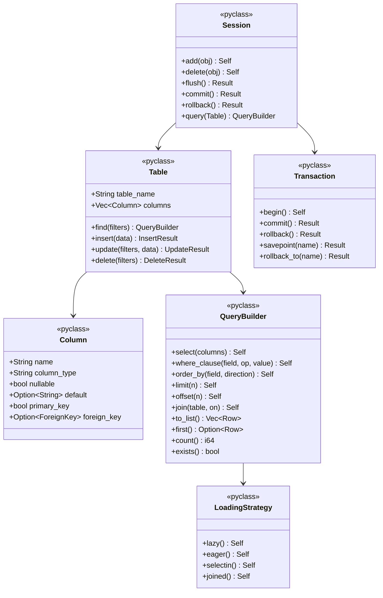

# Titan ORM Rust API Specification

## Overview

This spec defines the Rust ORM API that will be exposed to Python via PyO3.
All ORM logic is implemented in Rust; Python only provides type definitions.

## Class Diagram



## OpenRPC 1.3 Specification

```json
{
  "openrpc": "1.3.0",
  "info": {
    "title": "Titan ORM API",
    "version": "1.0.0"
  },
  "methods": [
    {
      "name": "Table.find",
      "params": [
        {"name": "filters", "schema": {"type": "array", "items": {"$ref": "#/components/schemas/Filter"}}}
      ],
      "result": {"$ref": "#/components/schemas/QueryBuilder"}
    },
    {
      "name": "QueryBuilder.select",
      "params": [
        {"name": "columns", "schema": {"type": "array", "items": {"type": "string"}}}
      ],
      "result": {"$ref": "#/components/schemas/QueryBuilder"}
    },
    {
      "name": "QueryBuilder.where_clause",
      "params": [
        {"name": "field", "schema": {"type": "string"}},
        {"name": "operator", "schema": {"$ref": "#/components/schemas/Operator"}},
        {"name": "value", "schema": {}}
      ],
      "result": {"$ref": "#/components/schemas/QueryBuilder"}
    },
    {
      "name": "QueryBuilder.order_by",
      "params": [
        {"name": "field", "schema": {"type": "string"}},
        {"name": "direction", "schema": {"enum": ["asc", "desc"]}}
      ],
      "result": {"$ref": "#/components/schemas/QueryBuilder"}
    },
    {
      "name": "QueryBuilder.limit",
      "params": [
        {"name": "n", "schema": {"type": "integer"}}
      ],
      "result": {"$ref": "#/components/schemas/QueryBuilder"}
    },
    {
      "name": "QueryBuilder.to_list",
      "params": [],
      "result": {"type": "array", "items": {"$ref": "#/components/schemas/Row"}}
    },
    {
      "name": "Transaction.begin",
      "params": [],
      "result": {"$ref": "#/components/schemas/Transaction"}
    },
    {
      "name": "Transaction.commit",
      "params": [],
      "result": {"type": "null"}
    },
    {
      "name": "Session.add",
      "params": [
        {"name": "obj", "schema": {}}
      ],
      "result": {"$ref": "#/components/schemas/Session"}
    },
    {
      "name": "Session.flush",
      "params": [],
      "result": {"type": "null"}
    }
  ],
  "components": {
    "schemas": {
      "Operator": {
        "type": "string",
        "enum": ["eq", "ne", "gt", "gte", "lt", "lte", "in", "not_in", "like", "ilike", "is_null", "is_not_null"]
      },
      "Filter": {
        "type": "object",
        "properties": {
          "field": {"type": "string"},
          "operator": {"$ref": "#/components/schemas/Operator"},
          "value": {}
        }
      },
      "Row": {
        "type": "object",
        "additionalProperties": true
      },
      "QueryBuilder": {
        "type": "object",
        "description": "Chainable query builder"
      },
      "Transaction": {
        "type": "object",
        "description": "Database transaction"
      },
      "Session": {
        "type": "object",
        "description": "ORM session with identity map"
      }
    }
  }
}
```

## Rust Implementation Notes

### PyO3 Bindings Pattern

```rust
#[pyclass]
#[derive(Clone)]
pub struct QueryBuilder {
    inner: Arc<RwLock<QueryBuilderInner>>,
}

#[pymethods]
impl QueryBuilder {
    fn select(&self, columns: Vec<String>) -> PyResult<Self> {
        let mut inner = self.inner.write().map_err(|e| PyRuntimeError::new_err(e.to_string()))?;
        inner.select_columns = columns;
        Ok(self.clone())
    }

    fn r#where(&self, field: &str, op: &str, value: &PyAny) -> PyResult<Self> {
        // Convert PyAny to Rust value, add to filters
        Ok(self.clone())
    }

    fn to_list<'py>(&self, py: Python<'py>) -> PyResult<&'py PyList> {
        // Execute query and convert results to Python
        pyo3_asyncio::tokio::future_into_py(py, async move {
            let results = self.inner.read()?.execute().await?;
            Python::with_gil(|py| {
                let list = PyList::new(py, results.iter().map(|r| r.to_py(py)));
                Ok(list)
            })
        })
    }
}
```

### GIL Release Pattern

```rust
fn heavy_operation(&self, py: Python<'_>) -> PyResult<Vec<Row>> {
    // Release GIL during I/O and CPU-intensive work
    py.allow_threads(|| {
        let rt = tokio::runtime::Runtime::new()?;
        rt.block_on(async {
            self.execute_query().await
        })
    })
}
```
