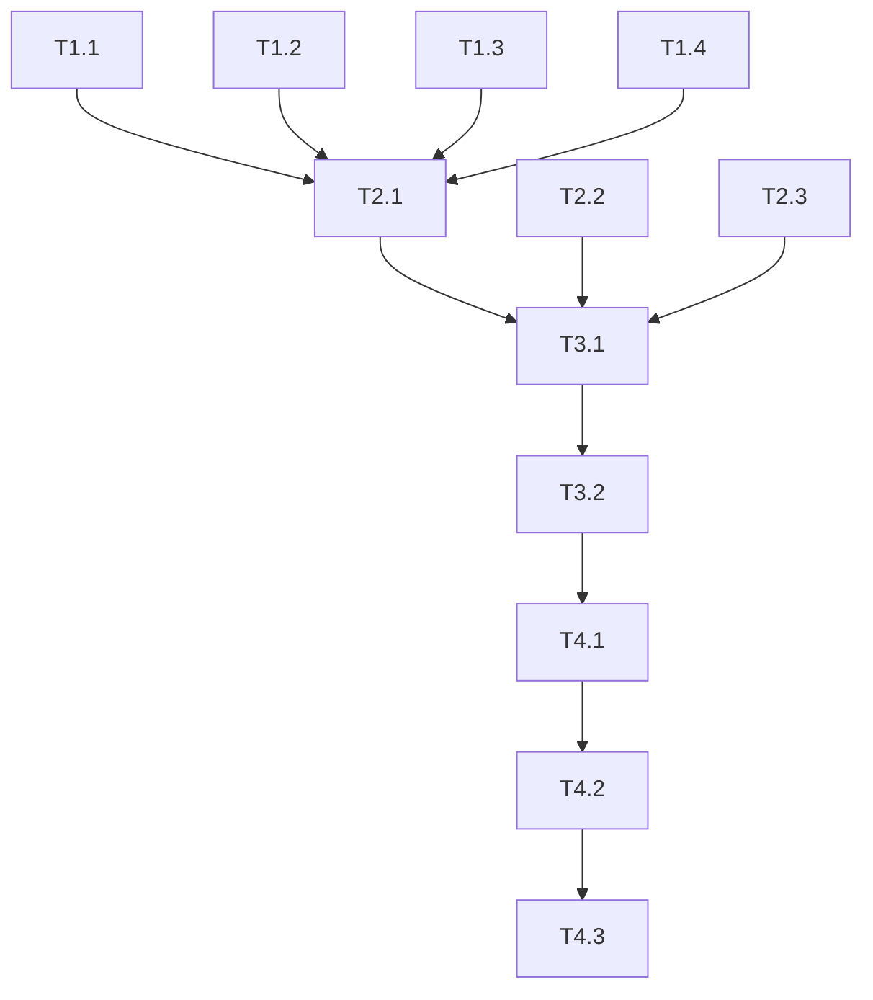

# Implementation Tasks

## Phase 1: Rust ORM Enhancement (cclab-titan)

### T1.1: Move QueryBuilder to Rust
- [ ] Create `crates/cclab-titan/src/query/builder_py.rs` with PyO3 bindings
- [ ] Implement fluent API: `select()`, `where()`, `order_by()`, `limit()`, `offset()`
- [ ] Implement terminal methods: `to_list()`, `first()`, `count()`, `exists()`
- [ ] Add GIL release for async operations
- [ ] Write tests

### T1.2: Move Transaction to Rust
- [ ] Create `crates/cclab-titan/src/transaction_py.rs` with PyO3 bindings
- [ ] Implement: `begin()`, `commit()`, `rollback()`, `savepoint()`, `rollback_to()`
- [ ] Add context manager support (`__enter__`, `__exit__`)
- [ ] Write tests

### T1.3: Move Session to Rust
- [ ] Create `crates/cclab-titan/src/session_py.rs` with PyO3 bindings
- [ ] Implement identity map pattern
- [ ] Implement unit of work: `add()`, `delete()`, `flush()`, `commit()`
- [ ] Write tests

### T1.4: Move Loading Strategies to Rust
- [ ] Create `crates/cclab-titan/src/loading_py.rs`
- [ ] Implement: `lazy()`, `eager()`, `selectin()`, `joined()`
- [ ] Write tests

## Phase 2: PyO3 Bindings (cclab-nucleus)

### T2.1: Create Titan Module
- [ ] Create `crates/cclab-nucleus/src/titan/mod.rs`
- [ ] Re-export all PyO3 classes from cclab-titan
- [ ] Register module in `lib.rs`

### T2.2: Rename Modules
- [ ] Rename `postgres` module to `titan` in cclab-nucleus
- [ ] Update `lib.rs` to use new module names
- [ ] Update Python imports

### T2.3: Remove Prism Bindings
- [ ] Remove `crates/cclab-nucleus/src/prism/` directory
- [ ] Remove prism from `lib.rs` module registration

## Phase 3: Python Code Generator

### T3.1: Enhance gen-python Command
- [ ] Update `crates/cclab-prism/src/gen/python/mod.rs`
- [ ] Add `PythonCodeGenerator` struct
- [ ] Implement `generate_init_py()` method
- [ ] Add CLI command in `crates/cclab-cli/src/main.rs`

### T3.2: Generate Thin Wrapper
- [ ] Generate `python/cclab/titan/__init__.py` (re-exports only)
- [ ] Generate `python/cclab/titan/__init__.pyi` (type stubs)
- [ ] Validate generated code compiles

## Phase 4: Migration

### T4.1: Update Python Package
- [ ] Delete old Python implementation files:
  - `python/cclab/titan/query.py` (moved to Rust)
  - `python/cclab/titan/transactions.py` (moved to Rust)
  - `python/cclab/titan/session.py` (moved to Rust)
  - `python/cclab/titan/loading.py` (moved to Rust)
  - `python/cclab/titan/relationships.py` (moved to Rust)
- [ ] Keep only auto-generated files
- [ ] Update `python/cclab/__init__.py`

### T4.2: Update Tests
- [ ] Update Python tests to use new imports
- [ ] Add Rust unit tests for moved logic
- [ ] Run full test suite

### T4.3: Documentation
- [ ] Update README with new architecture
- [ ] Add migration guide for users
- [ ] Document gen-python command

## Dependencies

## Estimates

| Phase | Complexity | Notes |
|-------|------------|-------|
| Phase 1 | High | Core ORM logic migration |
| Phase 2 | Medium | Mostly re-exports |
| Phase 3 | Medium | Enhance existing generator |
| Phase 4 | Low | Delete old code, update imports |
