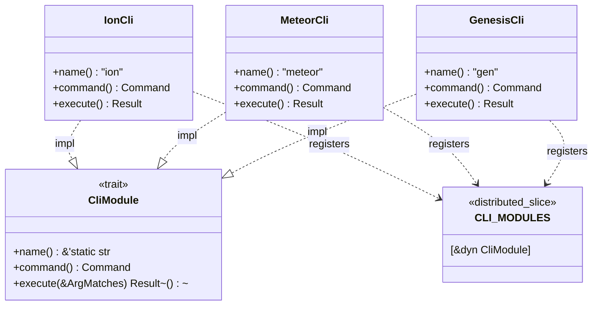

<spec>

# CLI Auto-Registration Infrastructure

## Overview

Defines the CLI auto-registration infrastructure using linkme distributed slices. Each crate can self-register CLI subcommands by implementing the CliModule trait and using the #[distributed_slice] macro. The main cclab-cli crate collects all registered modules at runtime and builds a unified clap::Command tree for dispatch.

## Requirements

### R1 - CliModule Trait

```yaml
id: R1
priority: high
status: draft
```

Define a CliModule trait in cclab-cli with methods: name() -> &'static str, command() -> clap::Command, execute(matches: &ArgMatches) -> Result<()>. The trait must be Send + Sync for thread safety.

### R2 - Distributed Slice Registration

```yaml
id: R2
priority: high
status: draft
```

Create a linkme distributed slice CLI_MODULES: [&'static dyn CliModule] that collects all registered CLI modules across crates at link time.

### R3 - Main CLI Aggregation

```yaml
id: R3
priority: high
status: draft
```

Refactor main.rs to iterate CLI_MODULES, build clap::Command tree from registered modules, and dispatch based on subcommand name match.

### R4 - Backward Compatibility

```yaml
id: R4
priority: medium
status: draft
```

Keep existing Commands enum and match dispatch as fallback during gradual migration. New registry-based dispatch takes precedence if module is registered.

### R5 - Example Migration

```yaml
id: R5
priority: medium
status: draft
```

Migrate at least one existing module (e.g., ion or meteor) to use the new registration pattern as proof of concept.

## Acceptance Criteria

### Scenario: Module auto-discovery

- **GIVEN** A crate implements CliModule and registers with #[distributed_slice(CLI_MODULES)]
- **WHEN** cclab binary is executed
- **THEN** The module's command appears in cclab --help without changes to main.rs

### Scenario: Command dispatch

- **GIVEN** User runs 'cclab ion stats'
- **WHEN** ion module is registered via CLI_MODULES
- **THEN** Dispatch routes to IonCli.execute() instead of legacy match

### Scenario: Legacy fallback

- **GIVEN** A command is not yet migrated to new registration
- **WHEN** User runs the legacy command
- **THEN** Falls back to existing Commands enum match dispatch

### Scenario: Multiple crates

- **GIVEN** cclab-genesis and cclab-cli both register modules
- **WHEN** Binary links both crates
- **THEN** All modules from both crates appear in unified CLI

## Flow Diagram



</spec>
