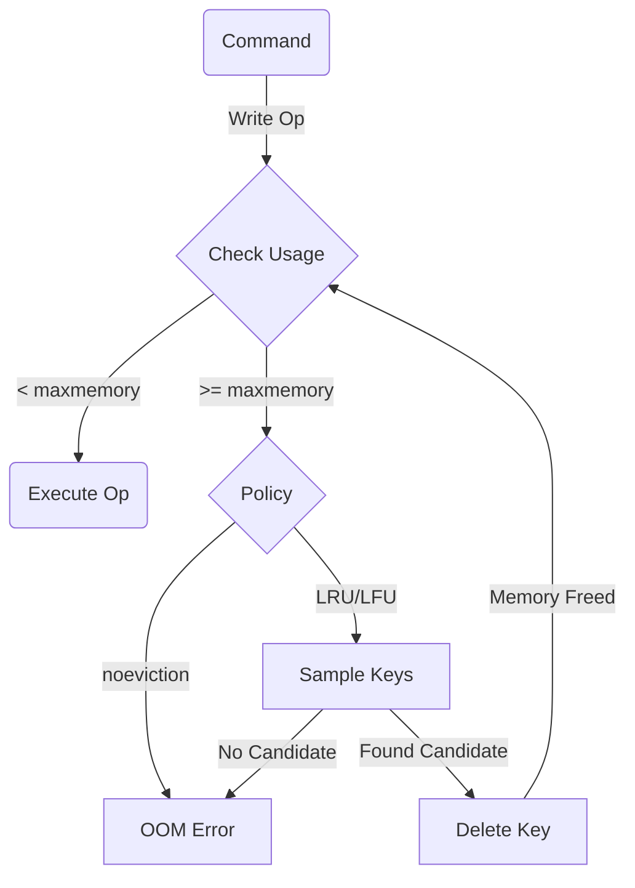

<spec>

# Memory Eviction

## Overview

Defines memory management policies to prevent Out-Of-Memory (OOM) conditions. Supports configuring a maximum memory limit and eviction strategies (LRU, LFU, Volatile) to free space when the limit is reached.

## Requirements

### R1 - Memory Limit

```yaml
id: R1
priority: medium
status: draft
```

Implement `maxmemory` configuration to set a limit on memory usage.

### R2 - Eviction Policies

```yaml
id: R2
priority: medium
status: draft
```

Implement eviction policies: `allkeys-lru`, `volatile-lru`, `allkeys-lfu`, `noeviction`.

### R3 - Eviction Trigger

```yaml
id: R3
priority: medium
status: draft
```

Trigger eviction loop when memory usage exceeds limit during write operations.

### R4 - Usage Tracking

```yaml
id: R4
priority: medium
status: draft
```

Track LRU (Last Recently Used) and LFU (Least Frequently Used) metadata for keys.

## Acceptance Criteria

### Scenario: Evict LRU

- **WHEN** Maxmemory reached, policy is allkeys-lru, 'A' is least recently used, client sets 'C'
- **THEN** Key 'A' is removed to make space for 'C'

### Scenario: No Eviction OOM

- **WHEN** Maxmemory reached, policy is noeviction, client sets 'C'
- **THEN** Returns OOM error

### Scenario: Evict Volatile Only

- **WHEN** Maxmemory reached, policy is volatile-lru, 'B' has TTL, 'A' does not
- **THEN** Key 'B' (with TTL) is removed, 'A' (persistent) is kept

## Diagrams

### Eviction Flow



</spec>
