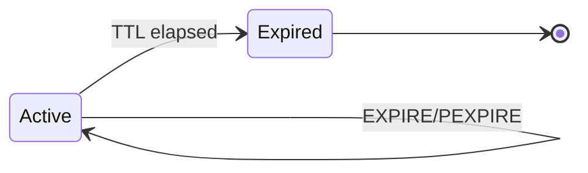

<spec>

# TTL Management

## Overview

Defines commands for managing key time-to-live (TTL). Adds support for setting, updating, removing, and querying expiration times with millisecond precision.

## Requirements

### R1 - Set TTL

```yaml
id: R1
priority: medium
status: draft
```

Implement EXPIRE (seconds) and PEXPIRE (milliseconds) commands to set the TTL for a key. Returns 1 if set, 0 if key does not exist.

### R2 - Get TTL

```yaml
id: R2
priority: medium
status: draft
```

Implement TTL (seconds) and PTTL (milliseconds) commands to get remaining time. Returns -2 if key doesn't exist, -1 if no TTL, or time remaining.

### R3 - Remove TTL

```yaml
id: R3
priority: medium
status: draft
```

Implement PERSIST command to remove the TTL from a key, making it persistent. Returns 1 if TTL removed, 0 if no TTL or key doesn't exist.

### R4 - Get and Expire

```yaml
id: R4
priority: medium
status: draft
```

Implement GETEX command to retrieve a value and optionally set/clear its TTL in one atomic operation.

## Acceptance Criteria

### Scenario: Set and Check TTL

- **WHEN** Client sets key 'foo', calls EXPIRE 'foo' 60
- **THEN** TTL returns approx 60 seconds, PTTL returns approx 60000ms

### Scenario: Persist Key

- **WHEN** Client calls PERSIST on a key with TTL
- **THEN** TTL returns -1 (no expiration)

### Scenario: Expire Immediately

- **WHEN** Client calls PEXPIRE 'foo' 0
- **THEN** Key does not exist

### Scenario: Get and Update TTL

- **WHEN** Client calls GETEX 'foo' EX 10
- **THEN** Returns value and TTL is updated to 10s

## Diagrams

### Key Expiration State



</spec>
