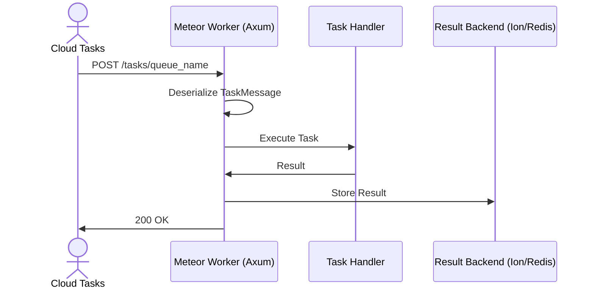

<spec>

# Meteor Maturity Upgrade Specification

## Overview

This specification covers the overall technical design for upgrading cclab-meteor to 95% maturity. It outlines the integration of cloud-native brokers, a Rust-native result backend, enhanced workflow primitives, and a management CLI.

## Requirements

### R1 - Push Brokers

```yaml
id: R1
priority: high
status: draft
```

Implement push-based delivery for GCP Cloud Tasks and Pub/Sub.

### R2 - Ion Backend

```yaml
id: R2
priority: high
status: draft
```

Support cclab-ion as a result backend for native Rust stacks.

### R3 - Enhanced Workflows

```yaml
id: R3
priority: high
status: draft
```

Enhance workflows (Chain, Group, Chord) with robust error handling and callbacks (on_success, on_error, on_retry).

### R4 - Meteor CLI

```yaml
id: R4
priority: medium
status: draft
```

Provide a unified CLI 'cc meteor' for worker and task management.

### R5 - Advanced Observability

```yaml
id: R5
priority: medium
status: draft
```

Expand metrics and tracing for better observability of distributed workflows.

## Acceptance Criteria

### Scenario: Execute Task via Cloud Tasks

- **WHEN** A task is published to GCP Cloud Tasks and pushed to the Meteor worker via HTTP.
- **THEN** The task is successfully processed and the worker returns a 200 OK status to Cloud Tasks.

### Scenario: Store Result in Ion Backend

- **WHEN** A task completes and the Ion result backend is configured.
- **THEN** The result is correctly persisted and can be retrieved using the Ion backend.

### Scenario: Workflow Callback Execution

- **WHEN** A task within a Chain succeeds and has an on_success callback defined.
- **THEN** The on_success callback is triggered and executed.

## Diagrams

### Cloud Tasks Push Flow



</spec>
