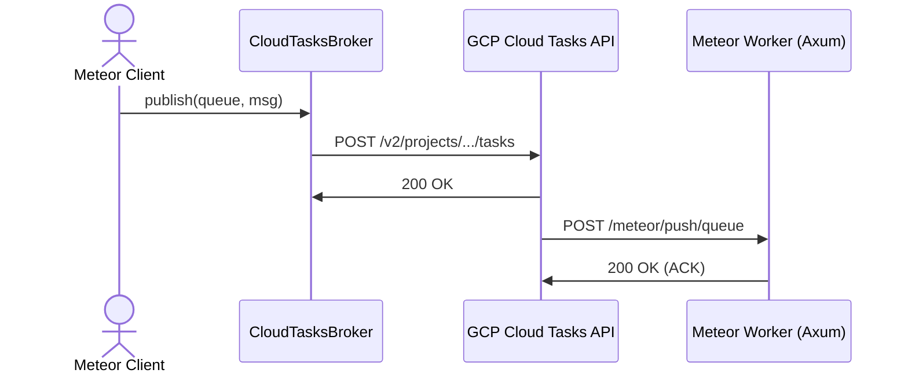

<spec>

# Meteor Cloud Brokers Specification

## Overview

Implementation details for GCP Cloud Tasks and Pub/Sub Push brokers in cclab-meteor. These brokers utilize a push-based delivery model where the broker sends HTTP requests to the worker.

## Requirements

### R1 - Cloud Tasks Broker

```yaml
id: R1
priority: high
status: draft
```

Implement CloudTasksBroker with publish and push-parsing capabilities.

### R2 - Pub/Sub Push Broker

```yaml
id: R2
priority: high
status: draft
```

Implement PubSubPushBroker for handling push notifications from GCP Pub/Sub.

### R3 - Push Handler Service

```yaml
id: R3
priority: high
status: draft
```

Develop an Axum-based HTTP handler for processing push requests from brokers.

## Acceptance Criteria

### Scenario: Cloud Tasks Dispatch

- **WHEN** A task is published via CloudTasksBroker and dispatched by GCP.
- **THEN** Meteor worker receives the HTTP request and executes the task.

### Scenario: Pub/Sub Push Delivery

- **WHEN** GCP Pub/Sub pushes a message to the configured Meteor endpoint.
- **THEN** The message is parsed and executed by the Meteor worker.

## Diagrams

### Cloud Tasks Push Broker Flow



## API Specification (OpenAPI 3.1)

```yaml
info:
  title: Meteor Push API
  version: 1.0.0
openapi: 3.1.0
paths:
  /meteor/push/{queue}:
    post:
      parameters:
      - in: path
        name: queue
        required: true
        schema:
          type: string
      responses:
        '200':
          description: Task acknowledged
        '500':
          description: Task failed, retry later
```

</spec>
