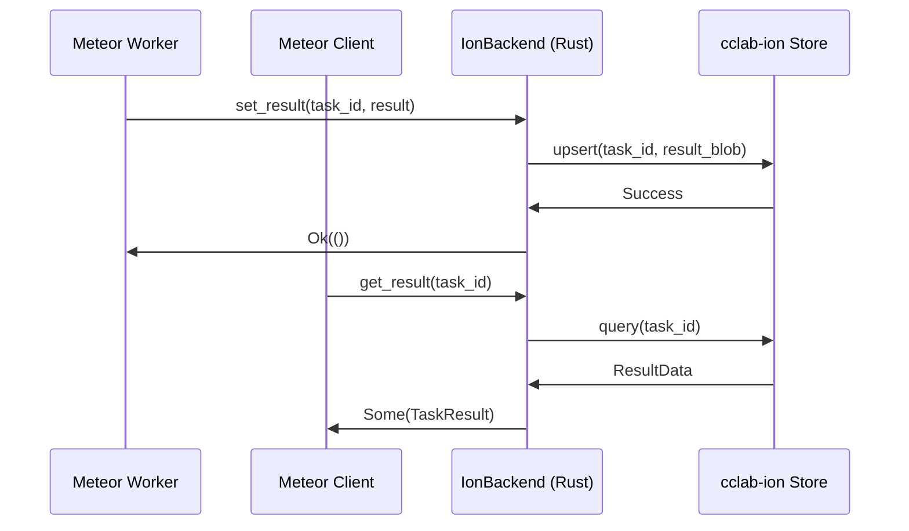

<spec>

# Meteor Ion Backend Specification

## Overview

Integration specification for using cclab-ion as a high-performance, Rust-native result backend for cclab-meteor.

## Requirements

### R1 - IonBackend Implementation

```yaml
id: R1
priority: high
status: draft
```

Implement ResultBackend trait for cclab-ion.

### R2 - Result Persistence

```yaml
id: R2
priority: high
status: draft
```

Support efficient storage and retrieval of large task results.

### R3 - Result TTL Support

```yaml
id: R3
priority: medium
status: draft
```

Implement result expiration and cleanup using Ion's TTL features.

## Acceptance Criteria

### Scenario: Store Task Result in Ion

- **WHEN** A task result is stored via IonBackend.set_result.
- **THEN** The result is persisted in cclab-ion and can be fetched.

### Scenario: Retrieve Task Result from Ion

- **WHEN** A client calls IonBackend.get_result with a valid task ID.
- **THEN** The correct task result is returned.

## Diagrams

### Ion Result Backend Flow



</spec>
