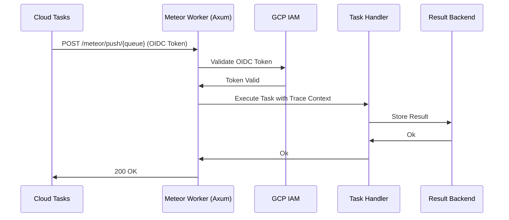

<spec>

# Meteor Maturity Upgrade Specification

## Overview

Overall technical design for upgrading cclab-meteor to 95% maturity. This upgrade focuses on production-readiness through cloud-native push brokers, NATS JetStream integration, high-performance result backends, and comprehensive observability.

## Requirements

### R1 - Secure Push Brokers

```yaml
id: R1
priority: high
status: draft
```

Implement push-based delivery for GCP Cloud Tasks and Pub/Sub with secure OIDC authentication.

### R2 - Ion Result Backend

```yaml
id: R2
priority: high
status: draft
```

Support cclab-ion as a high-performance, Rust-native result backend.

### R3 - NATS JetStream Support

```yaml
id: R3
priority: high
status: draft
```

Integrate NATS JetStream for durable task persistence and explicit acknowledgement support.

### R4 - Deep Observability

```yaml
id: R4
priority: medium
status: draft
```

Full OpenTelemetry tracing integration for distributed workflows and broker-level metrics.

### R5 - Management CLI

```yaml
id: R5
priority: medium
status: draft
```

Unified 'cc meteor' CLI for worker status, queue purging, and task revocation.

## Acceptance Criteria

### Scenario: Cloud Tasks Execution with OIDC

- **WHEN** A task is pushed from Cloud Tasks with an OIDC identity token.
- **THEN** The worker validates the OIDC token and processes the task, returning 200 OK.

### Scenario: Durable NATS Consumption

- **WHEN** A worker restarts while consuming from a NATS JetStream durable consumer.
- **THEN** The worker resumes from the last acknowledged message on restart.

### Scenario: Trace Workflow Execution

- **WHEN** A workflow Chain is executed across multiple distributed workers.
- **THEN** A single trace ID covers the entire chain across different workers.

## Diagrams

### Cloud Tasks Push Flow with OIDC and Tracing



</spec>
