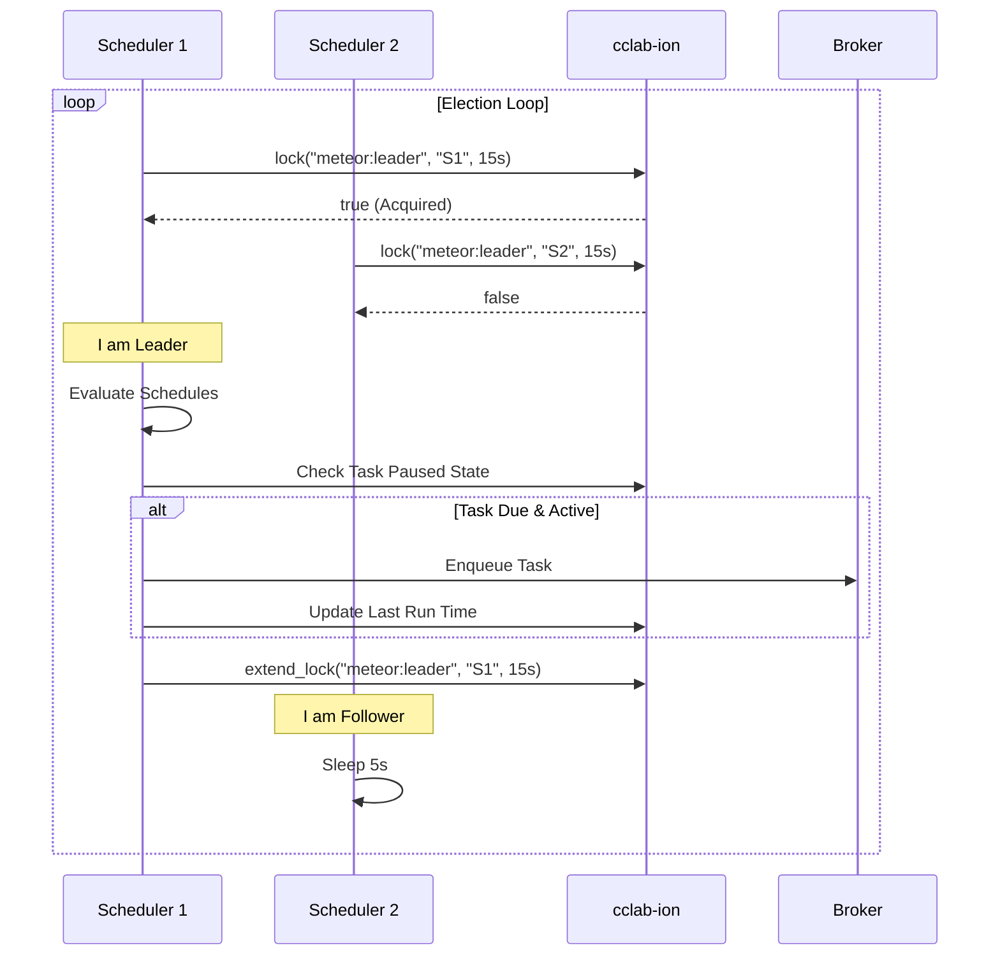

# Change: improve-meteor-scheduler

## Summary

Add robust, Celery Beat-compatible cron scheduling to `cclab-meteor`, featuring distributed leader election via `cclab-ion`, crontab syntax support, and a management CLI.

## Why

Current applications require periodic background tasks (e.g., daily reports, cache cleanup). While `cclab-meteor` supports basic scheduling, it currently lacks:

1. **Distributed Safety**: Without locking, multiple replicas would schedule duplicate tasks.
2. **Standard Syntax**: Crontab support is essential for complex schedules.
3. **Runtime Management**: Ability to pause/resume tasks without redeploying.

## What Changes

### 1. Scheduler Architecture

Enhance `PeriodicScheduler` to support a pluggable backend architecture:

- **`SchedulerBackend` Trait**: For leader election and state persistence.
- **`IonSchedulerBackend`**: Implementation using `cclab-ion` for distributed locking and state storage.

### 2. Schedule Definitions

Support two types of triggers:

- **Cron**: `*/5 * * * *` (using `cron` crate).
- **Interval**: `Duration` (e.g., "every 30s").

### 3. Distributed Locking (Leader Election)

The scheduler will use a **Leader Election** pattern:

- All instances try to acquire a lock (`meteor:scheduler:leader`) with a short TTL (e.g., 15s).
- Only the leader evaluates the schedule and pushes tasks.
- Followers loop and retry lock acquisition.

### 4. Dynamic State & CLI

Allow "Pause/Resume" and "Trigger" by storing task state in Ion:

- Key: `meteor:schedule:state:{task_name}` -> `paused` | `active`.
- CLI: `meteor schedule list`, `meteor schedule pause <name>`, `meteor schedule trigger <name>`.

## Impact

- **New Dependencies**: `cron` (crate), `cclab-ion-client` (for locking).
- **Affected Modules**: `crates/cclab-meteor/src/scheduler/periodic.rs`, `crates/cclab-meteor/src/lib.rs`.
- **Breaking Changes**: None (feature is additive).

---

## Architecture



## Data Model

```rust
/// Configuration for a periodic task
pub struct PeriodicTaskConfig {
    pub name: String,
    pub task: String,
    pub args: Vec<serde_json::Value>,
    pub kwargs: HashMap<String, serde_json::Value>,
    pub schedule: ScheduleType,
    pub options: TaskOptions,
}

pub enum ScheduleType {
    /// Crontab syntax: "*/5 * * * *"
    Cron(String),
    /// Fixed interval: 30s, 5m, 1h
    Interval(Duration),
}

/// Stored state for a task (in Ion)
pub struct TaskScheduleState {
    pub enabled: bool,
    pub last_run_at: Option<DateTime<Utc>>,
    pub total_run_count: u64,
}
```

## Interfaces

```rust
#[async_trait]
trait SchedulerBackend: Send + Sync {
    /// Try to become the leader
    async fn acquire_leader(&self, ttl: Duration) -> Result<bool>;

    /// Renew leadership
    async fn renew_leader(&self, ttl: Duration) -> Result<bool>;

    /// Get dynamic state for a task
    async fn get_task_state(&self, name: &str) -> Result<TaskScheduleState>;

    /// Set dynamic state for a task
    async fn set_task_state(&self, name: &str, state: TaskScheduleState) -> Result<()>;
}
```

## Config Example (Celery Beat compatible)

```python
from cclab.meteor import PeriodicTask, crontab, schedule

# Config-based definition (like CELERYBEAT_SCHEDULE)
METEOR_SCHEDULE = {
    "cleanup-expired-sessions": PeriodicTask(
        task="app.tasks.cleanup_sessions",
        schedule=crontab(minute="0", hour="*/6"),  # Every 6 hours
    ),
    "send-daily-report": PeriodicTask(
        task="app.tasks.send_report",
        schedule=crontab(minute="0", hour="9"),    # Daily at 9 AM
    ),
    "heartbeat": PeriodicTask(
        task="app.tasks.heartbeat",
        schedule=schedule(seconds=30),             # Every 30 seconds
    ),
}
```

## CLI Commands

```bash
# List all scheduled tasks
cc meteor schedule list

# Pause a task
cc meteor schedule pause cleanup-expired-sessions

# Resume a task
cc meteor schedule resume cleanup-expired-sessions

# Manually trigger a task
cc meteor schedule trigger send-daily-report

# Show task details
cc meteor schedule info heartbeat
```
