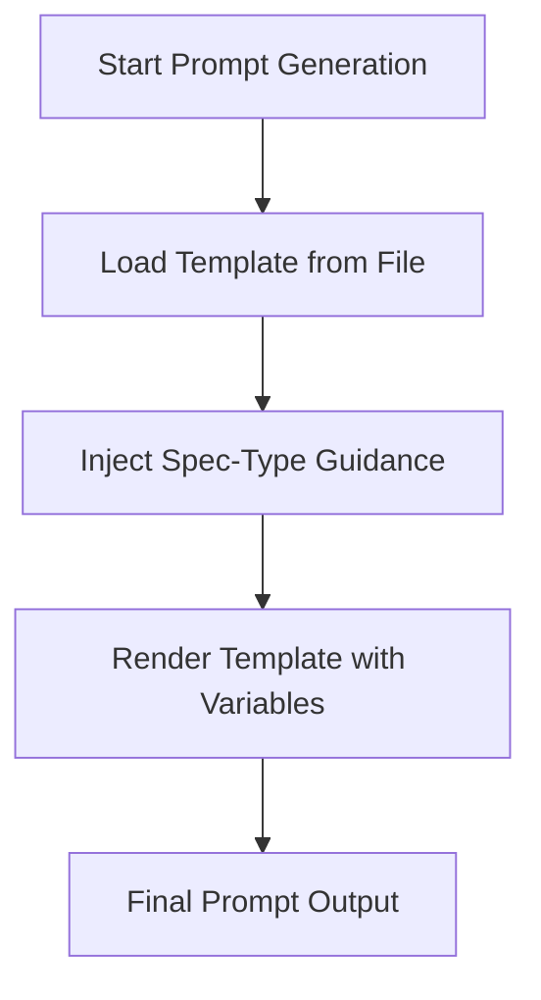

<spec>

# Spec Generation Improvement Specification

## Overview

This specification defines the improvements to Gemini spec generation to favor formal specification languages (OpenAPI, AsyncAPI, OpenRPC, etc.) over ambiguous natural language descriptions. It covers updates to prompt templates, centralization of specification rules, and enhancement of automated validation.

## Requirements

### R1 - Formal Language Examples in Prompts

```yaml
id: R1
priority: high
status: draft
```

Prompt templates for spec creation and revision must include detailed, copy-pasteable examples of formal specification languages (OpenAPI 3.1, AsyncAPI 2.6, etc.).

### R2 - Centralized Spec Type Guidance

```yaml
id: R2
priority: high
status: draft
```

The orchestrator should provide spec_type-specific guidance derived from a central source of truth (SpecType enum) to ensure consistency between prompts and validation.

### R3 - Strict Validation Enforcement

```yaml
id: R3
priority: medium
status: draft
```

The validate_spec_completeness tool and SemanticValidator must strictly enforce the presence of required API specifications for each spec_type.

### R4 - Comprehensive Formal Spec Coverage

```yaml
id: R4
priority: medium
status: draft
```

Ensure that all non-utility spec types have a corresponding machine-readable formal specification.

## Acceptance Criteria

### Scenario: Template includes OpenAPI example

- **WHEN** The gemini_spec_with_mcp_prompt is called with spec_type='http-api'.
- **THEN** The rendered prompt contains a detailed OpenAPI 3.1 JSON example with paths and components.

### Scenario: Validation fails on missing API spec

- **WHEN** validate_spec_completeness is run on a http-api spec without an OpenAPI block.
- **THEN** The tool returns is_complete=false with a missing_elements entry for OpenAPI 3.1.

### Scenario: Semantic annotations in flowchart required

- **WHEN** An algorithm spec contains a flowchart without 'semantic' fields.
- **THEN** A warning or error is generated indicating the missing semantic metadata.

## Diagrams

### Prompt Generation Flow



</spec>
