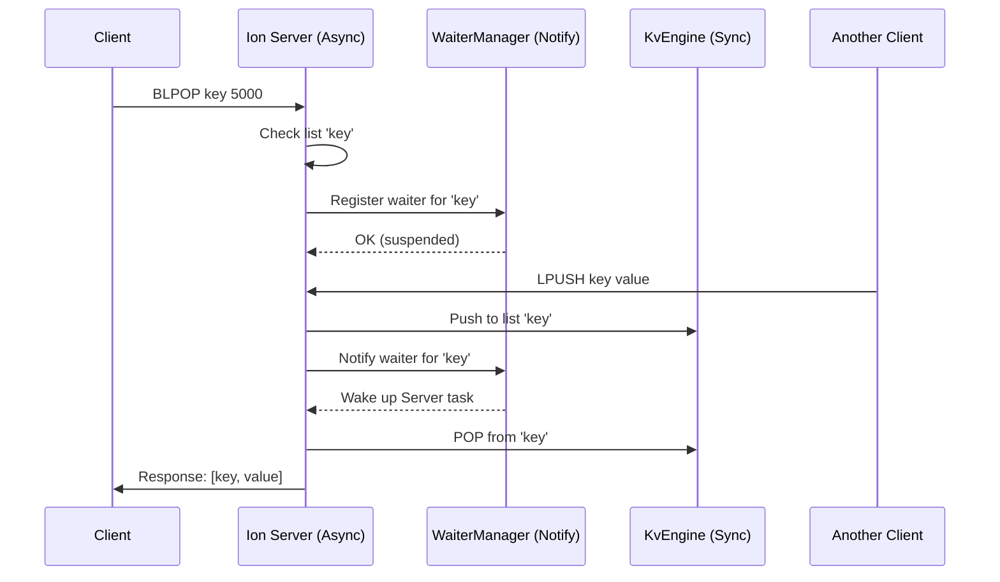

<spec>

# Blocking List Operations Design

## Overview

This specification details the implementation of blocking list operations (BLPOP/BRPOP) alongside standard list operations. The core mechanism involves an asynchronous 'WaiterManager' in the server that suspends client requests until data is available, leveraging tokio::sync::Notify for efficient waking.

## Requirements

### R1 - Protocol Extension

```yaml
id: R1
priority: medium
status: draft
```

Add LPUSH (0x12), RPUSH (0x13), LPOP (0x14), RPOP (0x15), BLPOP (0x16), BRPOP (0x17) to the binary protocol.

### R2 - List Push Operations

```yaml
id: R2
priority: medium
status: draft
```

LPUSH/RPUSH add elements to head/tail and return new length. Payload: key_len(2) + key + value.

### R3 - List Pop Operations

```yaml
id: R3
priority: medium
status: draft
```

LPOP/RPOP remove and return elements from head/tail. Payload: key.

### R4 - Blocking Pop Operations

```yaml
id: R4
priority: medium
status: draft
```

BLPOP/BRPOP block the client until an element is available or timeout. Payload: timeout_ms(8) + num_keys(2) + [key_len(2) + key]. Returns: [key, value] or Null.

### R5 - WaiterManager Implementation

```yaml
id: R5
priority: medium
status: draft
```

The server must manage a mapping of keys to a list of waiting 'tokio::sync::Notify' handles. Notify must be triggered on any PUSH to that key.

### R6 - Client Async Support

```yaml
id: R6
priority: medium
status: draft
```

Client must support async BLPOP/BRPOP with cancellation safety.

## Acceptance Criteria

### Scenario: LPUSH then LPOP

- **GIVEN** An empty list 'tasks'
- **WHEN** LPUSH 'tasks' 'job1' followed by LPOP 'tasks'
- **THEN** LPOP 'tasks' returns 'job1' and list is empty.

### Scenario: BLPOP blocks and resumes

- **GIVEN** An empty list 'tasks'
- **WHEN** Client A calls BLPOP 'tasks' 5s. Client B calls LPUSH 'tasks' 'job1' 1s later.
- **THEN** The BLPOP call returns ('tasks', 'job1') within 1s.

### Scenario: BLPOP timeout

- **GIVEN** An empty list 'tasks'
- **WHEN** Client A calls BLPOP 'tasks' with 1s timeout and no PUSH occurs.
- **THEN** The BLPOP call returns Null/None after exactly 1 second.

## Flow Diagram



</spec>
