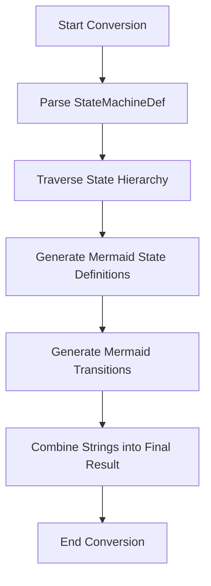

<spec>

# Mermaid+ Conversion Algorithm Specification

## Overview

This specification details the algorithm for converting a structured StateMachineDef into a Mermaid stateDiagram-v2 string. This conversion is the core of the Mermaid+ format generation and must be implemented in cclab-aurora.

## Requirements

### R1 - Recursive State Generation

```yaml
id: R1
priority: high
status: draft
```

Implement a recursive traversal of the StateMachineDef states to generate Mermaid state definitions, including support for atomic, compound, and parallel states. Implementation in crates/cclab-aurora/src/diagrams/mermaid_plus.rs.

### R2 - Transition Generation

```yaml
id: R2
priority: high
status: draft
```

Generate Mermaid transitions from the 'on' handlers, correctly formatting event labels with guards and actions.

### R3 - Initial/Final State Support

```yaml
id: R3
priority: medium
status: draft
```

Support special state types like 'initial' and 'final', translating them into [*] transitions in Mermaid.

## Acceptance Criteria

### Scenario: Convert compound state

- **GIVEN** A StateMachineDef with a compound state containing nested substates.
- **WHEN** The conversion algorithm is executed.
- **THEN** The resulting Mermaid code should correctly nest the substates within the parent state block.

### Scenario: Convert complex transition labels

- **GIVEN** A transition with both a guard and an action.
- **WHEN** The conversion algorithm processes the transition.
- **THEN** The transition label should be formatted as 'event [guard] / action'.

### Scenario: Convert initial and final states

- **GIVEN** A state machine with an initial state and a final state.
- **WHEN** The conversion algorithm is executed.
- **THEN** The output should contain '[*] --> initial_state' and 'final_state --> [*]'.

## Diagrams

### State Machine to Mermaid Conversion Flow



</spec>
