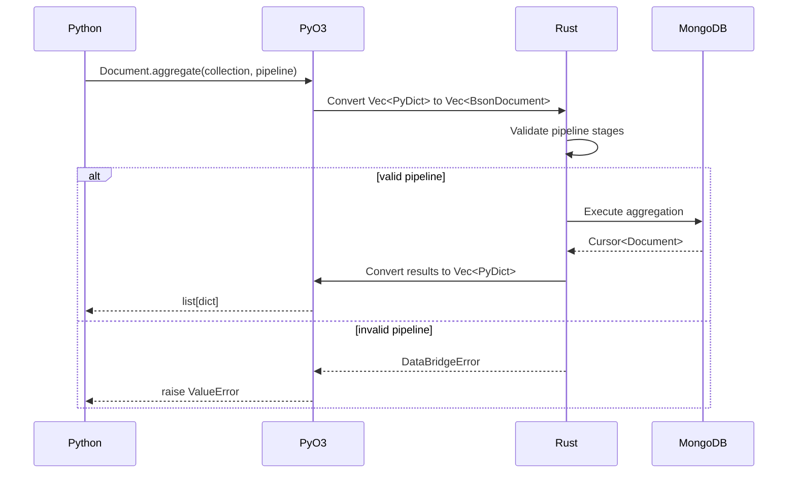

<spec>

# PyO3 Aggregation Bindings

## Overview

實作 PyO3 bindings 將 Rust AggregationBuilder 暴露給 Python。包含 Document::aggregate() 方法和 Python-friendly helpers。支援從 Python list 轉換為 Rust pipeline，並將結果轉回 Python dict。

## Requirements

### R1 - Document::aggregate 方法

```yaml
id: R1
priority: high
status: draft
```

在 RustDocument 新增 async fn aggregate(collection: &str, pipeline: Vec<PyDict>) -> Vec<PyDict> 方法

### R2 - Pipeline 轉換

```yaml
id: R2
priority: high
status: draft
```

將 Python list[dict] 轉換為 Vec<BsonDocument>，使用現有的 py_dict_to_bson 函數

### R3 - 結果轉換

```yaml
id: R3
priority: high
status: draft
```

將 MongoDB aggregation 結果轉換為 Python list[dict] 回傳

### R4 - PyAggregationBuilder class

```yaml
id: R4
priority: low
status: draft
```

可選：暴露 AggregationBuilder 為 PyO3 class 讓 Python 直接使用 fluent API

### R5 - 錯誤處理

```yaml
id: R5
priority: medium
status: draft
```

將 Rust 錯誤轉換為適當的 Python exceptions (PyValueError, PyRuntimeError)

## Acceptance Criteria

### Scenario: Python 執行 aggregate

- **GIVEN** Python 呼叫 Document.aggregate(collection, pipeline)
- **WHEN** pipeline 是有效的 list[dict]
- **THEN** 執行 MongoDB aggregation 並回傳 list[dict] 結果

### Scenario: 無效 pipeline

- **GIVEN** Python 傳入不合法的 pipeline
- **WHEN** pipeline 包含無效的 stage
- **THEN** 拋出 PyValueError 包含清晰的錯誤訊息

### Scenario: 空結果

- **GIVEN** aggregation 無符合的文件
- **WHEN** 執行 aggregate
- **THEN** 回傳空 list []

## Flow Diagram


```

</spec>
