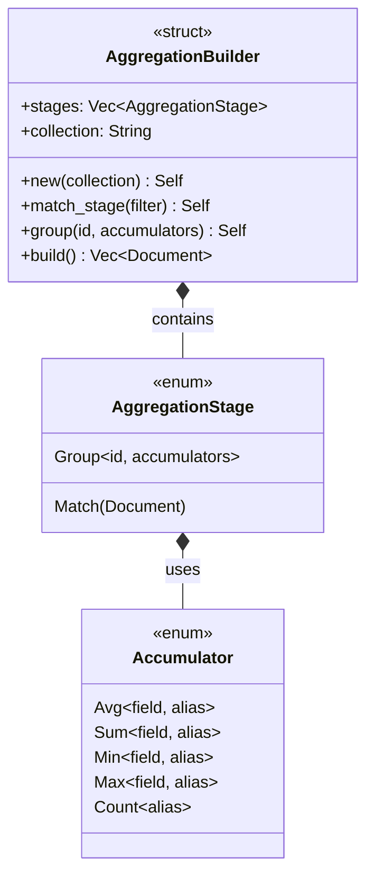

<spec>

# Rust AggregationBuilder 類型設計

## Overview

定義 Rust 端的 AggregationBuilder fluent API 和 AggregationStage enum，涵蓋 $match 和 $group stages。提供 avg/sum/min/max/count helpers。使用 Rust builder pattern 提供類型安全的 pipeline 建構。

## Requirements

### R1 - AggregationBuilder struct

```yaml
id: R1
priority: high
status: draft
```

定義 AggregationBuilder struct 支援 fluent API pattern，包含 stages: Vec<AggregationStage> 和 collection_name: String

### R2 - AggregationStage enum

```yaml
id: R2
priority: high
status: draft
```

定義 enum AggregationStage 包含 Match(BsonDocument) 和 Group { id: GroupId, accumulators: Vec<Accumulator> } variants

### R3 - Accumulator helpers

```yaml
id: R3
priority: high
status: draft
```

提供 avg(), sum(), min(), max(), count() 方法建立對應的 $group accumulators

### R4 - Pipeline 建構

```yaml
id: R4
priority: high
status: draft
```

AggregationBuilder 提供 match_stage(filter) 和 group(id, accumulators) 方法，回傳 Self 支援鏈式呼叫

### R5 - Build 方法

```yaml
id: R5
priority: medium
status: draft
```

build() 方法將 AggregationBuilder 轉換為 Vec<BsonDocument> pipeline

## Acceptance Criteria

### Scenario: 建立 avg aggregation

- **GIVEN** 需要計算欄位平均值
- **WHEN** 呼叫 builder.match_stage(filter).group(None, vec![avg("price")]).build()
- **THEN** 產生 [{"$match": filter}, {"$group": {"_id": null, "result": {"$avg": "$price"}}}]

### Scenario: 建立 count aggregation

- **GIVEN** 需要計算符合條件的文件數量
- **WHEN** 呼叫 builder.match_stage(filter).group(None, vec![count()]).build()
- **THEN** 產生 [{"$match": filter}, {"$group": {"_id": null, "count": {"$sum": 1}}}]

### Scenario: 無 match stage

- **GIVEN** 不需要過濾
- **WHEN** 呼叫 builder.group(None, vec![sum("amount")]).build()
- **THEN** 產生 [{"$group": {"_id": null, "result": {"$sum": "$amount"}}}]

## Flow Diagram


```

## API Specification (JSON Schema)

```yaml
$schema: https://json-schema.org/draft/2020-12/schema
description: MongoDB aggregation pipeline stage
oneOf:
- properties:
    $match:
      description: Filter document
      type: object
  required:
  - $match
  title: Match
  type: object
- properties:
    $group:
      properties:
        _id:
          description: Group key (null for single result)
        result:
          description: Accumulator expression
          type: object
      required:
      - _id
      type: object
  required:
  - $group
  title: Group
  type: object
title: AggregationStage
```

</spec>
