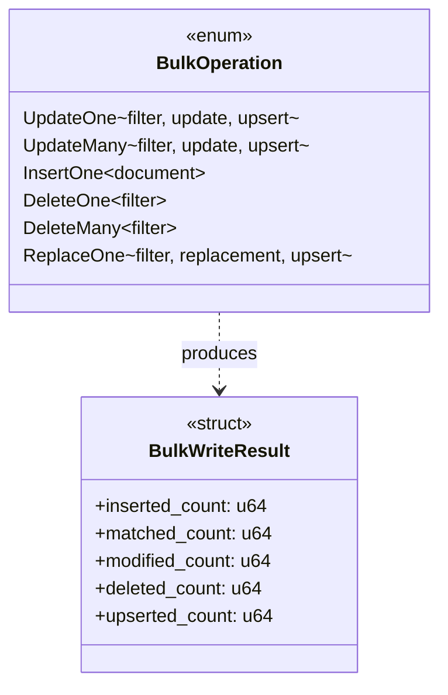

<spec>

# Rust BulkOperation Enum 設計

## Overview

定義 Rust 端的 BulkOperation enum，涵蓋所有 MongoDB bulk write 操作類型。使用 Rust enum 提供完整的類型安全和 pattern matching 支援。這是 Thin Wrapper 架構的核心資料結構。

## Requirements

### R1 - BulkOperation Enum 定義

```yaml
id: R1
priority: high
status: draft
```

定義 enum BulkOperation 包含所有 MongoDB bulk write 操作類型: UpdateOne, UpdateMany, InsertOne, DeleteOne, DeleteMany, ReplaceOne

### R2 - Filter 和 Update Document

```yaml
id: R2
priority: high
status: draft
```

每個 variant 必須包含適當的欄位: filter (bson::Document), update (Option<bson::Document>), replacement (Option<bson::Document>), upsert (bool)

### R3 - Serde 支援

```yaml
id: R3
priority: medium
status: draft
```

實作 Serialize 和 Deserialize trait 以支援 JSON 和 BSON 序列化

### R4 - Debug 和 Clone

```yaml
id: R4
priority: low
status: draft
```

實作 Debug 和 Clone trait 以支援除錯和複製操作

## Acceptance Criteria

### Scenario: UpdateOne 操作

- **GIVEN** 一個 UpdateOne BulkOperation
- **WHEN** 轉換為 MongoDB WriteModel
- **THEN** 產生正確的 update_one 操作

### Scenario: InsertOne 操作

- **GIVEN** 一個 InsertOne BulkOperation 包含 document
- **WHEN** 轉換為 MongoDB WriteModel
- **THEN** 產生正確的 insert_one 操作

### Scenario: DeleteMany 操作

- **GIVEN** 一個 DeleteMany BulkOperation 包含 filter
- **WHEN** 轉換為 MongoDB WriteModel
- **THEN** 產生正確的 delete_many 操作

### Scenario: Upsert 支援

- **GIVEN** 一個 UpdateOne BulkOperation with upsert=true
- **WHEN** 轉換為 MongoDB WriteModel
- **THEN** 產生包含 upsert 選項的 update_one 操作

## Flow Diagram


```

## API Specification (JSON Schema)

```yaml
$schema: https://json-schema.org/draft/2020-12/schema
description: MongoDB bulk write operation types
oneOf:
- properties:
    filter:
      description: MongoDB filter document
      type: object
    op:
      const: update_one
    update:
      description: MongoDB update document
      type: object
    upsert:
      default: false
      type: boolean
  required:
  - op
  - filter
  - update
  title: UpdateOne
  type: object
- properties:
    filter:
      type: object
    op:
      const: update_many
    update:
      type: object
    upsert:
      default: false
      type: boolean
  required:
  - op
  - filter
  - update
  title: UpdateMany
  type: object
- properties:
    document:
      description: Document to insert
      type: object
    op:
      const: insert_one
  required:
  - op
  - document
  title: InsertOne
  type: object
- properties:
    filter:
      type: object
    op:
      const: delete_one
  required:
  - op
  - filter
  title: DeleteOne
  type: object
- properties:
    filter:
      type: object
    op:
      const: delete_many
  required:
  - op
  - filter
  title: DeleteMany
  type: object
- properties:
    filter:
      type: object
    op:
      const: replace_one
    replacement:
      type: object
    upsert:
      default: false
      type: boolean
  required:
  - op
  - filter
  - replacement
  title: ReplaceOne
  type: object
title: BulkOperation
```

</spec>
